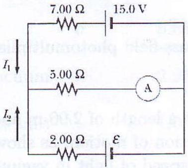

7. Two ideal cells and three resistors with resistances $2.00,5.00$ and $7.00 \Omega$ are connected as shown in Figure 2. If the ammeter reads 2 A , determine the currents $I_{1}$, $I_{2}$ and $\mathcal{E}$. [9]

Figure 2: DC Circuit
