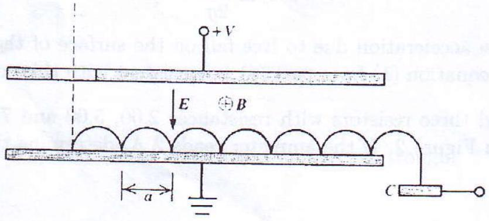

9. Figure 3 shows the principle of operation of a crossed-field photomultiplier. A sealed and evacuated enclosure contains two parallel plates called dynodes. These plates provide the electric field $\vec{E}$. An external permanent magnet superimposes a magnetic field $\vec{B}$. A photon ejects a low energy photoelectron. The electron accelerates upwards under the electric field but it is deflected to the negative dynode by the magnetic field. On impact with the dynode it ejects a few secondary electrons and the process repeats itself until eventually the electrons impinge on a collector $C$. Assuming that there is a steady voltage $V$ between the plates and that the first photoelectron is emitted with zero initial speed, i.e. $\frac{d y}{d t}=\frac{d x}{d t}=0$ at $x=y=0$,
    (i) write down differential equaion to describe the horizontal and vertical velocity of the electrons as a function of $x$ and $y$, [8]
    (ii) solve the differential equations for $x(t)$ and $y(t)$ (this trajectory is a cycloid), [4]
    (iii) find the maximum value of $y$, and [4]
    (iv) determine the value of $a$. [4]

Figure 3: Cross-field photomultiplier.
