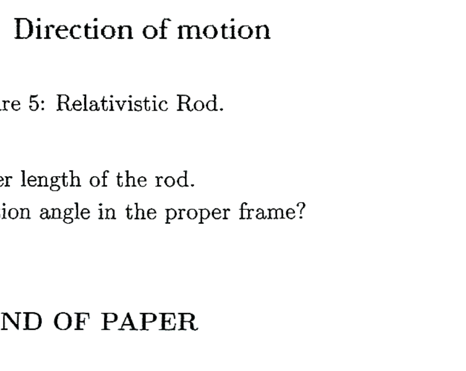

10. (a) The Oscillation Project with Emulsion-tRacking Apparatus (OPERA), an experiment designed to test neutrino oscillations and exploiting the high energy muon neutrinos produced at CERN Super Proton Synchrotron in Geneva and pointing towards Gran Sasso in Italy, reported that the time of flight measurements indicated that muon neutrinos travel at speed $v$ which is faster than the speed of light with $\beta=\frac{v}{c}=1+1.48 \times 10^{-5}$, where $c$ is the speed of light in vacua. Show that it is possible for an observer moving relative to the Earth starting at CERN and moving towards Gran Sasso at some critical speed $u$ to see the muon neutrino moving backwards from Gran Sasso towards CERN and determine this critical speed.
(b) A moving rod is observed to have a length of 2.00 m and to be oriented at an angle of $30.0^{\circ}$ with respect to the direction of motion, as shown in Figure 5. The rod has a speed of 0.995c.

Figure 5: Relativistic Rod.

(i) Determine the proper length of the rod.
(ii) What is the orientation angle in the proper frame?

## END OF PAPER
