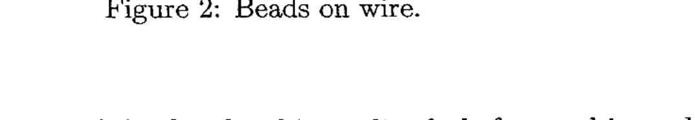

3. Suppose that we have a string of equally spaced beads of mass $m$ such that their surfaces are separated by a distance $d$. The beads are free to slide without friction on a thin wire. Suppose that there is a constant force $F$ acting on the first bead, initially at rest, and causing it to accelerate along the wire as shown in Figure 2. This force acts only on the first bead and might be created by a well directed, steady stream of air. The first bead will collide with the second, which will in turn collide with the third, and so on. Suppose that all collisions are elastic.

Figure 2: Beads on wire.

(i) What is the speed of the first bead immediately before and immediately after its collision with the second bead?
(ii) What is the speed of the second bead immediately before and immediately after its collision with the third bead?
(iii) Note that the constant force is always acting upon the first bead. What is the time interval between subsequent collisions between the first and second beads? What then is the average speed of the first bead? What is the speed of the "shock wave" that travels down the wire?
(iv) If the whole process is repeated, but with collisions which are perfectly inelastic, what is the terminal speed of the shock wave formed?
