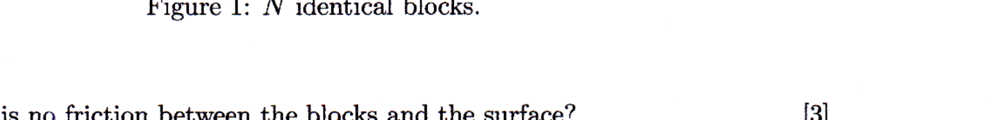

9. A collection of $N$ identical blocks, each of mass $M$, are connected by unstretchable ropes of negligible mass. The blocks are on a horizontal surface. An external force $F_{0}$ acts on Block 1, pulling it horizontally to the right with constant velocity. What is the tension in the rope connecting Block $n$ to Block $n+1$, if

Figure 1: $N$ identical blocks.

(i) There is no friction between the blocks and the surface?
(ii) The coefficient of kinetic friction between each block and the surface is $\mu_{k}$ ? ( $F_{0}$ large enough to accelerate the blocks despite the friction.)
