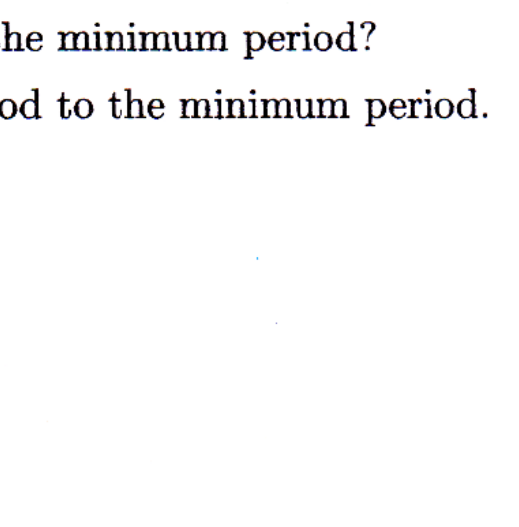

3. A pendulum bob is constructed by taking a thin, uniform-density circular ring of mass $M$ and radius $R$ and affixing a straight, thin, uniform density rod of mass m and length $2 R$ across its diameter as shown in the diagram. The pendulum hangs in a vertical plane from a frictionless pivot that can be attached to the ring at any point. The pivot allows the bob to swing either in the plane of the bob or in the plane perpendicular to the bob. Assume the angular amplitude is small.

(i) What swinging configurations give the maximum period?
(ii) What swinging configurations give the minimum period?
(iii) Find the ratio of the maximum period to the minimum period.
