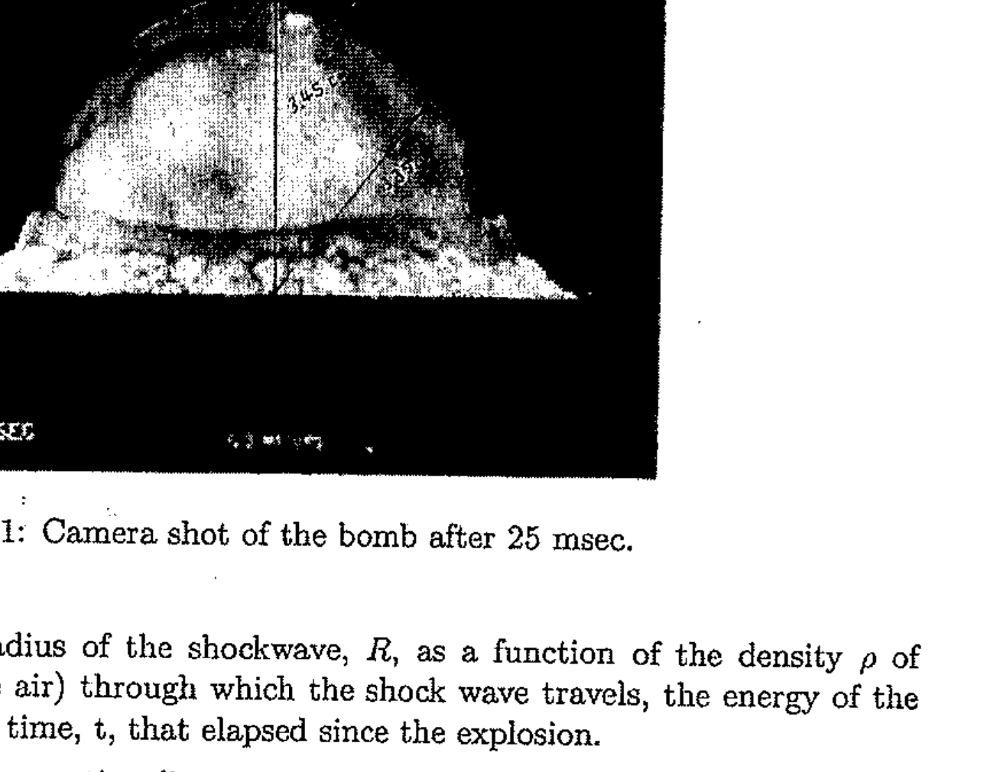

8. The first explosion of the atomic bomb was conducted near Alamogoro, New Mexico on July 16, 1945. Figure 1 shows a picture of the approximately spherical shockwave 25 msec with the tick marks indicating 100 m Using dimensional analysis, find an

Figure 1: Camera shot of the bomb after 25 msec .

expression for the radius of the shockwave, $R$, as a function of the density $\rho$ of the medium (i.e. the air) through which the shock wave travels, the energy of the explosion, $E$ and the time, t , that elapsed since the explosion.
Assuming that the proportionality constant is unity (i.e. 1), as predicted by Sir Geoffrey Taylor, and assuming that the density of air, $\rho$, is $1.2 \mathrm{~kg} \mathrm{~m}^{-3}$, and that the explosion of 1000 kg of TNT releases an energy of $4.184 \times 10^{9} \mathrm{~J}$, estimate, from the picture, the approximate energy of this explosion expressed as tons ( 1000 kg ) of TNT equivalent.
