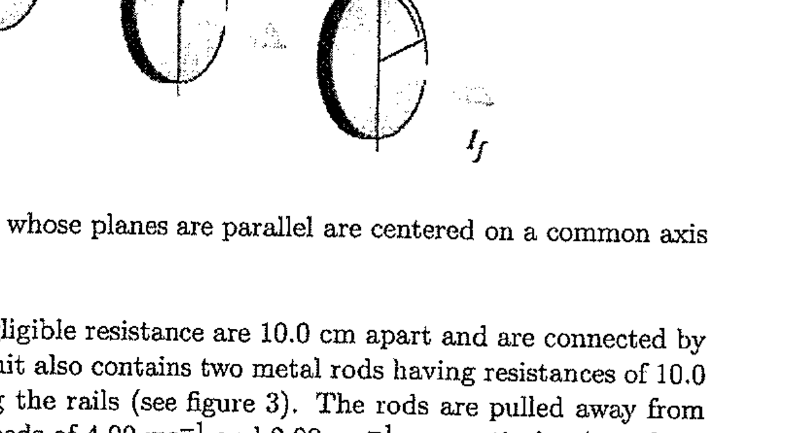

7. Three polarizing disks whose planes are parallel are centered on a common axis. The direction of the transmission axis in each case is shown in Figure 2 relative to the common vertical direction. A plane-polarized beam of light with E 0 parallel to the vertical reference direction is incident from the left on the first disk with intensity $I_{0}=10.0$ in some arbitrary units. Calculate the transmitted intensity If when
(i) $\theta_{1}=20.0^{\circ}, \theta_{2}=40.0^{\circ}$, and $\theta_{3}=60.0^{\circ}$;
(ii) $\theta_{1}=0^{\circ}, \theta_{2}=30.0^{\circ}$, and $\theta_{3}=60.0^{\circ}$;
(iii) If $\theta_{1}=0^{\circ}$ and $\theta_{3}=60.0^{\circ}$, find the angle $\theta_{2}$ so that maximum intensity passes through the three polarizers.

Figure 2: Three polarizing disks whose planes are parallel are centered on a common axis
