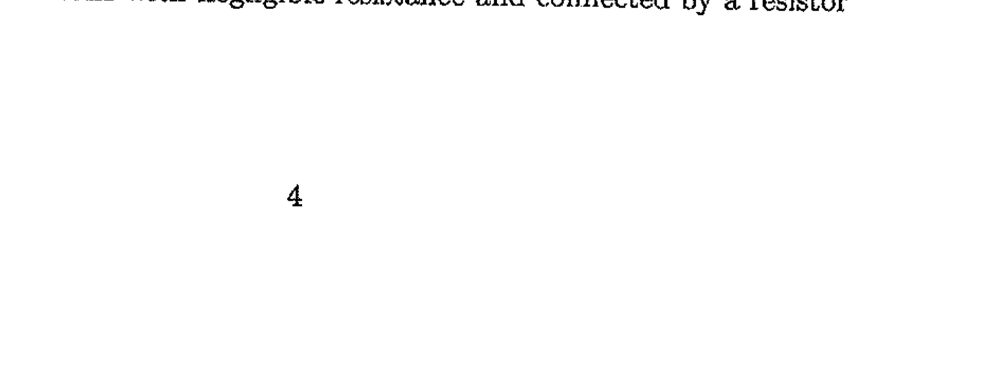

8. Two parallel rails with negligible resistance are 10.0 cm apart and are connected by a $5.00 \Omega$ resistor. The circuit also contains two metal rods having resistances of 10.0 $\Omega$ and $15.0 \Omega$ sliding along the rails (see figure 3). The rods are pulled away from the resistor at constant speeds of $4.00 \mathrm{~ms}^{-1}$ and $2.00 \mathrm{~ms}^{-1}$, respectively. A uniform magnetic field of magnitude 0.0100 T is applied perpendicular to the plane of the rails. Determine the current in the $5.00 \Omega$ resistor.

Figure 3: Two parallel rails with negligible resistance and connected by a resistor
