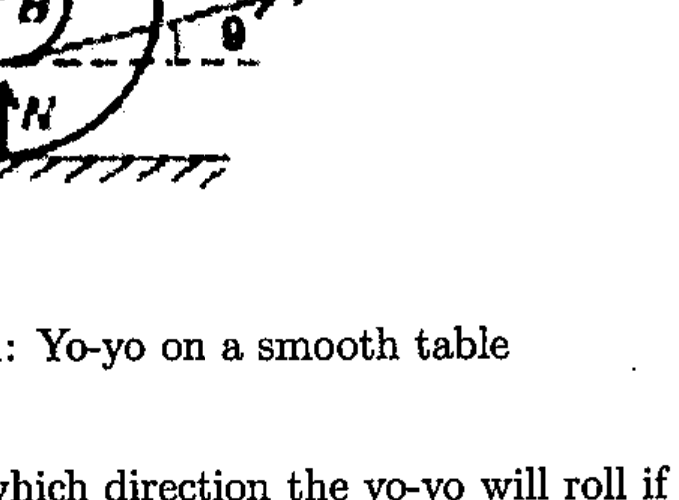

8. Yo-Yo! A yo-yo of mass $M$ lies on a smooth horizontal table as shown below. The moment of inertia about the center may be taken as $\frac{1}{2} M A^{2}$. A string is pulled with force $F$ from the inner radius $B$ as indicated below.

Figure 1: Yo-yo on a smooth table

(a) Draw diagrams to show which direction the yo-yo will roll if $\theta=0, \pi / 2, \pi$.
(b) For what value of $\theta$ will the yo-yo slide without rolling independent of the roughness (coefficient of friction) of the table or the magnitude of $F$ ?
(c) At what angle $\theta$ will the yo-yo roll, independent of the smoothness of the table? [5]
2. Yo-yo continued A yo-yo is pulled by its string along a horizontal surface without slipping. The horizontal velocity of the end of the string remains equal to $v$. A bar is pivoted as shown and remains supported by the yo-yo. Find the angular speed of the bar $\omega$ as a function of the angle $\theta$. The outer and the inner radii of the yo-yo are $R$ and $r$ respectively.

Figure 2: Pulled yo-yo and supported bar
