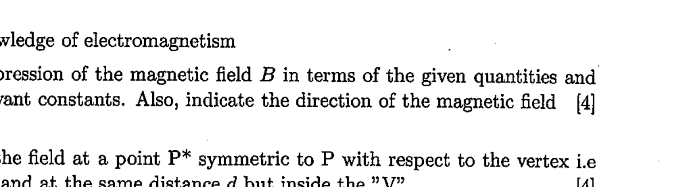

9. Among the first successes of the interpretation by Ampere of magnetic phenomena, we have the computation of the magnetic field $B$ generated by wires carrying an electric current, as compared to early assumptions originally made by Biot and Savart.
A particularly interesting case is that of a very long thin wire, carrying a constant current $i$, made out of two rectilinear sections and bent in the form of a " V ", with angular half-span $\alpha$ (see figure). According to Ampere's computations, the magnitude B of the magnetic field in a given point P lying on the axis of the " V ", outside of it and at a distance $d$ from its vertex, is proportional to $\tan \left(\frac{\alpha}{2}\right)$. Ampere's work was later embodied in Maxwell's electromagnetic theory, and is universally accepted.

Figure 3: Configuration of V-shaped wire

Using our knowledge of electromagnetism
(a) find an expression of the magnetic field $B$ in terms of the given quantities and any other relevant constants. Also, indicate the direction of the magnetic field [4]
(b) Compute the field at a point $\mathrm{P}^{*}$ symmetric to P with respect to the vertex i.e along the axis and at the same distance $d$ but inside the "V".
