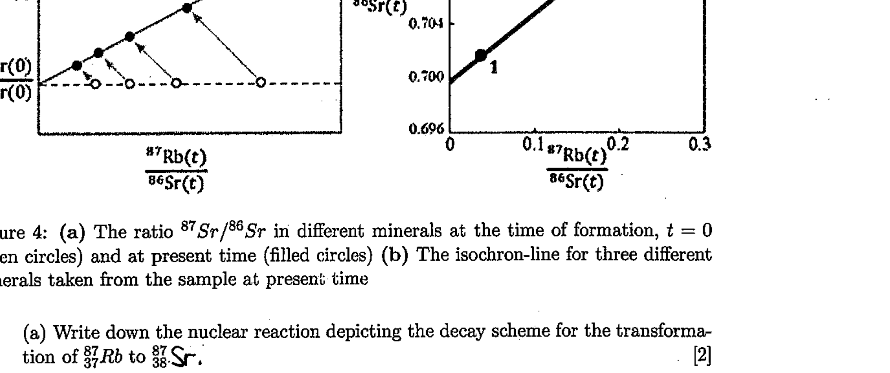

10. Radioactive dating of sample ${ }^{87} R b$ (element no 37) decays into the stable isotope ${ }^{87} S r$ (element no. 38) with a half life of $T_{\frac{1}{2}}=4.9 \times 10^{10}$ year, relative to the stable isotope ${ }^{86} \mathrm{Sr}$. At the point of formation, the ratio ${ }^{87} \mathrm{Sr} /{ }^{86} \mathrm{Sr}$ was identical for all minerals in the sample while the ratio ${ }^{87} R b /{ }^{86} S r$ was quite different. As time passes on, the amount of ${ }^{87} R b$ decreases by decay, while consequently the amount of ${ }^{87} \mathrm{Sr}$ increases. As a result, the ratio of ${ }^{87} \mathrm{Sr} /{ }^{86} \mathrm{Sr}$ will be different today. In the following figure(a), the points on the horizontal line refer to the ratio ${ }^{87} R b /{ }^{86} S r$ in different minerals at the formation of the sample.

Figure 4: (a) The ratio ${ }^{87} \mathrm{Sr} /{ }^{86} \mathrm{Sr}$ in different minerals at the time of formation, $t=0$ (open circles) and at present time (filled circles) (b) The isochron-line for three different minerals taken from the sample at present time

(a) Write down the nuclear reaction depicting the decay scheme for the transformation of ${ }_{37}^{87} R b$ to ${ }_{38}^{87} S r$.
(b) Show that the present-time ratio ${ }^{87} S r /{ }^{86} S r$ was plotted versus the present-time ratio ${ }^{87} \mathrm{Rb} /{ }^{86} \mathrm{Sr}$ in different mineral samples from the same sample forms a straight line (the isochron line), with slope $a(t)=\left(e^{\lambda t}-1\right)$. Here $t$ is the time since the formation of the minerals, while $\lambda$ is the decay constant inversely proportional to half-life $T_{\frac{1}{2}}$.
(c) Determine the age $\tau_{m}$ of the sample using the isochron line as in the above diagram.

## END OF PAPER

## SOME FUNDAMENTAL CONSTANTS OF PHYSICS

| Constant | Symbol | Computational value |
| :--- | :--- | :--- |
| Avogadro's number | $N$ | $6.023 \times 10^{23} \mathrm{~mole}^{-1}$ |
| Boltzmann constant | $k$ | $1.38 \times 10^{23} \mathrm{JK}^{-1}$ |
| Elementary charge | $e$ | $1.6 \times 10^{-19} \mathrm{C}$ |
| Electron rest mass | $m_{e}$ | $9.11 \times 10^{-31} \mathrm{~kg}$ |
| Neutron rest mass | $m_{n}$ | $1.68 \times 10^{-27} \mathrm{~kg}$ |
| Proton rest mass | $m_{p}$ | $1.67 \times 10^{-27} \mathrm{~kg}$ |
| Planck's constant | $h$ | $6.63 \times 10^{-34} \mathrm{Js}$ |
| Permittivity constant | $\epsilon_{0}$ | $8.85 \times 10^{-12} \mathrm{Fm}^{-1}$ |
| Permeability constant | $\mu_{0}$ | $4 \pi \times 10^{-7} \mathrm{Hm}^{-1}$. |
| Stefan's constant | $\sigma$ | $5.68 \times 10^{-8} \mathrm{Wm}^{-2} \mathrm{~K}^{4}$ |
| Speed of light in vacuum | $c$ | $2.997 \times 10^{8} \mathrm{~ms}^{-1}$ |
| Unified atomic mass unit | $u$ | $1.66 \times 10^{-27} \mathrm{~kg}$ |
| Universal gas constant | $R$ | $8.31 \mathrm{~J} \mathrm{~mol}^{-1} \mathrm{~K}^{-1}$ |
