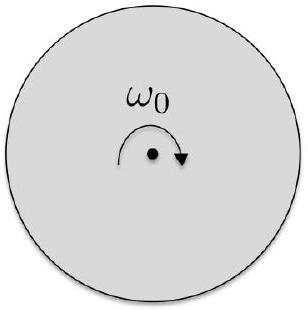
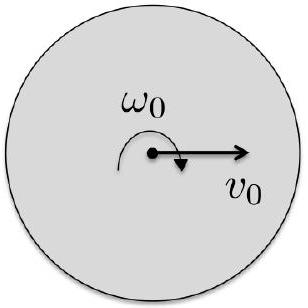
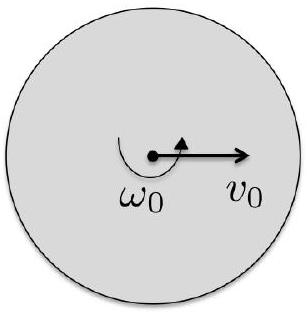

2. Consider a rigid axially symmetric wheel with mass $M$, moment of inertia $I$ about the axis of symmetry $S$, and radius $R$, moving in an upright position on a horizontal plane. The coefficient of kinetic friction between the wheel and the plane is $\mu_{k}$.
(a) The wheel is initially spun about $S$ with constant angular speed $\omega_{0}$, and is then released. It slips for a time $T_{a}$ and then rolls without slipping. Determine $T_{a}$ and the centre-of-mass speed $v_{a}$ of the rolling wheel.

Figure 2: Rolling wheel with initial angular speed $\omega_{0}$.

[4 marks]
(b) The wheel has an initial horizontal centre-of-mass speed $v_{0}$ in addition to an initial angular speed $\omega_{0}$. Determine the time $T_{b}$ at which the wheel rolls without slipping and the centre of mass speed $v_{b}$ of the rolling wheel.

Figure 3: Rolling wheel with initial angular speed $\omega_{0}$ and initial horizontal centre-of-mass speed $v_{0}$.

[4 marks]
(c) The wheel has an initial horizontal centre of mass speed $v_{0}$ and an initial backspin $-\omega_{0}$. Determine the possible motions of the wheel.

Figure 4: Rolling wheel with initial backspin of angular speed $\omega_{0}$ and initial horizontal centre-of-mass speed $v_{0}$.

[4 marks]
