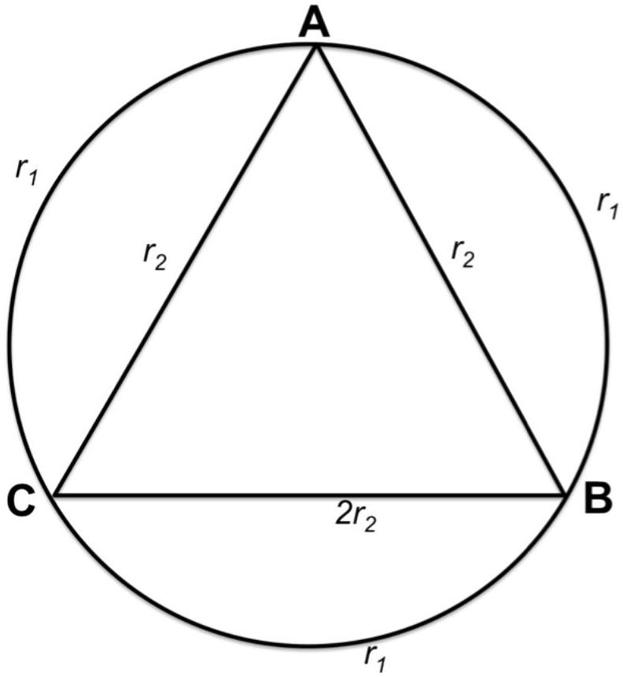

3. A circular coil with radius $a$ is connected with an equilateral triangle on the inside as shown in the figure below. The resistance for each section of the wire is labeled. A uniform magnetic field $B(t)$ is pointing into the paper, perpendicular to the plane of the coil. $B(t)$ is decreasing over time at a constant rate $k$. Given $2 r_{1}=3 r_{2}$. Find $U_{A B}$, the potential difference between points A and B.

Figure 5: Circular coil with 3 wires forming an equilateral triangle inside the circle.

[10 marks]
