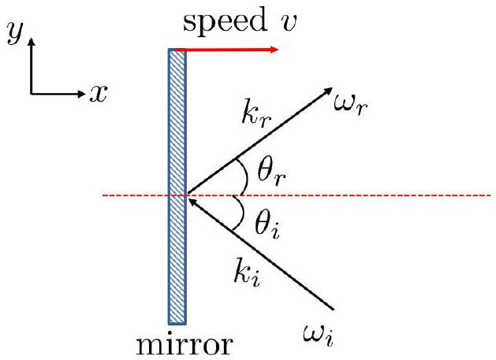

5a. [5 marks] Consider two inertial frames S and S' whereby observer is stationary in S. S' frame is moving with relativistic speed $v$ in the in $x$-direction with respect to the observer. The relation between the spacetime coordinates of S and S' frame is given by the Lorentz transformation

$$
\begin{aligned}
c t^{\prime} & =\gamma(c t-\beta x) \\
x^{\prime} & =\gamma(x-\beta c t) \\
y^{\prime} & =y \\
z^{\prime} & =z
\end{aligned}
$$

where

$$
\gamma=\frac{1}{\sqrt{1-\beta^{2}}}
$$

and

$$
\beta=\frac{v}{c} .
$$

Suppose the quantity $\mathbf{k} \cdot \mathbf{r}-\omega t$ is an invariant quantity, that is

$$
\mathbf{k}^{\prime} \cdot \mathbf{r}^{\prime}-\omega^{\prime} t^{\prime}=\mathbf{k} \cdot \mathbf{r}-\omega t
$$

where $k \equiv|\mathbf{k}|=\omega / c$ is the wave vector, r is the position vector and $\omega$ is the angular frequency. Find $\omega^{\prime}, c \mathbf{k}^{\prime}$ in terms of $\omega, \mathbf{k}$, and $\gamma$.
□
(b) [5 marks] A plane mirror (S' frame) is moving through vacuum with relativistic speed $v$ in the $x$ direction. As seen by observer in S, a beam of light with frequency $\omega_{i}$ is incident (from $x=+\infty$ ), at angle $\theta_{i}$ to the normal, on the plane mirror. The beam of light is reflected back at an angle $\theta_{r}$ to the normal and at frequency $\omega_{r}$ as shown in figure below. Here $\mathbf{k}_{i}$ and $\mathbf{k}_{r}$ are the incident and reflected wave vectors respectively.
Hint: Law of reflection is only valid in mirror's frame.

Figure 1: Reflection on a moving mirror

(i) What is the frequency of the reflected light $\omega_{r}$ expressed in terms of $\omega_{i}, \beta$ and $\theta_{i}$ ?
(ii) What is the energy of the each photon in the reflected beam?

|  |
| :--- |
