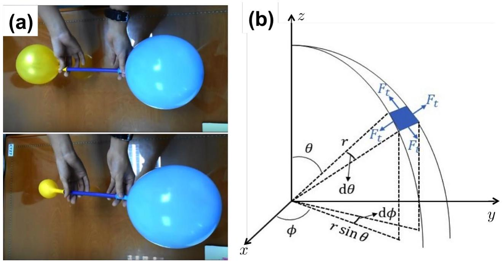

6. Funny Balloon

The two balloons experiment is a famous counter-intuitive experiment involving two interconnected balloons of different radii. In this experiment, two identical balloons are initially inflated to different radii. They are then connected to both ends of a tube, allowing air flow between them. This results in the smaller balloon becoming smaller while the larger balloon becoming larger. This observation is surprising since conventional intuition suggests that both balloons should end up equal in sizes after allowing air flow between them. This question studies the physics behind this surprising result. For simplicity, we assume that the balloons are made up of spherical shells and all changes in sizes take place under isothermal conditions.

Figure 2: (a) The sizes of the balloons before and after exchanging air. (b) Tension in a rubber fragment making up a spherical rubber shell of radius $r$. The rubber fragment can be thought as an area formed by two arcs of two different circles. One edge of the rubber fragment is a segment from a circle at an angle $\phi$ from the $x-z$ plane, with radius $r$. The other edge is a segment from a circle in the $x-y$ plane, with radius $r \sin \theta$. There are tensions acting on all four sides of the rubber fragment. Each tension is in a direction tangent to the arc forming the fragment, pointing away from the fragment.

(a) Pressure-radius curve

The tension in a stretched rubber is given as

$$
F_{r} \propto \frac{r}{r_{0}^{2}}\left[1-\left(\frac{r_{0}}{r}\right)^{6}\right]
$$

where is $r$ the radius of the inflated balloon and $r_{0}$ is the original radius of the balloon. Fig. 2(b) shows a sketch of the direction of tension in a rubber fragment that is part of the spherical shell.

(i) [3 marks] Show that the internal air pressure of the balloon relative to the atmospheric pressure is given by
$$
P=\frac{C}{r_{0}^{2} r}\left[1-\left(\frac{r_{0}}{r}\right)^{6}\right]
$$
where $C$ is a constant.
(ii) [1 mark] Show that the internal pressure of the balloon is maximum when the radius is
$$
r_{\max }=7^{\frac{1}{6}} r_{0}
$$
(iii) [2 marks] Sketch the pressure-radius graph of the balloon. Label the points $r_{0}$ and $r_{\text {max }}$ on the graph.

|  |
| :--- |

6b. Suppose two balloons of two different radii are connected to two ends of a very thin tube with a valve, initially closed to prevent exchange of air between the balloons. The initial radius of the smaller balloon $r_{s i}$ is at its maximum as given

$$
r_{s i}=7^{\frac{1}{6}} r_{0}
$$

The balloons reach equilibrium after the valve is opened for some time. At equilibrium, the radius of the smaller balloon is

$$
r_{s f}=6^{\frac{1}{6}} r_{0}
$$

(i) [2 marks] Calculate the radius of the bigger balloon $r_{b f}$ at equilibrium. Leave your answer in 3 decimal places in terms of $r_{0}$. You may use numerical methods to solve this question.
(ii) [3 marks] Calculate the initial radius of the bigger balloon, $r_{b i}$ when the valve was still closed. Leave your answer in 3 decimal places in terms of $r_{0}$. You may use numerical methods to solve this question.
(iii) [4 marks] Given the following quantities:
$A=$ cross-sectional area of the tube,
$m=$ average mass of one air molecule,
$k=$ Boltzmann constant,
$T=$ temperature at which the two balloons experiment is conducted,
$r_{b}=$ radius of the bigger balloon at a given instant and
$r_{s}=$ radius of the smaller balloon at a given instant,
show that the time taken for the balloons to reach the equilibrium state is given by

$$
t=\frac{16 \pi}{3 A} \sqrt{\frac{m}{k T}}\left[\int_{r_{b i}}^{r_{b f}} d r_{b} \frac{r_{b}\left[1-2\left(\frac{r_{0}}{r_{b}}\right)^{6}\right]}{\frac{1}{r_{s}}\left[1-\left(\frac{r_{0}}{r_{s}}\right)^{6}\right]-\frac{1}{r_{b}}\left[1-\left(\frac{r_{0}}{r_{b}}\right)^{6}\right]}\right]
$$
