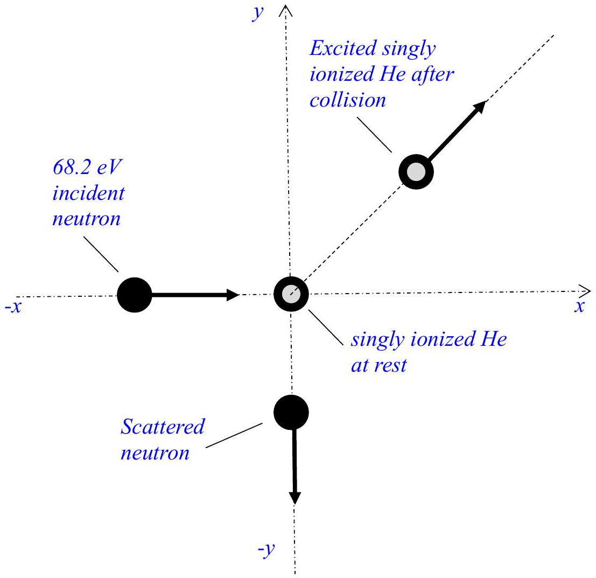

1. In the figure below, a singly ionized helium, with electron in its ground state i.e. $\mathrm{n}=1$, is at rest at position O. A neutron of kinetic energy of 68.2 eV is moving from the left towards O and collides inelastically with the singly ionized helium. The neutron is scattered at an angle of 90° with respect to its original direction of motion i.e. towards ' $-y$ ' axis. The singly ionized helium after collision is excited and moves as is shown in the Figure 1. It may be noted that the mass of singly ionized helium is four times the mass of the neutron and the energy levels in the ionized helium atom are given by $E_{n}=-\frac{54.4}{n^{2}} \mathrm{eV}$.

Fig. 1

    (a) Find the allowed values of the kinetic energy of the scattered neutron and the kinetic energy of the single ionized helium after collision.

[8 marks]

SPhO 2018 Theory Paper 2

(b) If the singly ionized helium get de-excited subsequently by emitting radiation, find the shortest and longest wavelengths of the emitted radiation. For this part assume that the momentum of the emitted photon is negligible.
[4 marks]

(c) When an atom emits a photon in a transition from the quantum state with energy $E_{i}$ to the quantum state with energy $E_{f}$, the energy of the photon is not exactly equal to $E_{i}-E_{f}$. This is because the atom must recoil and thus some of the transition energy becomes the kinetic energy of recoil of the atom. Estimate the percentage of this transition energy, $E_{i}-E_{f}$, that becomes the recoil kinetic energy of the recoiling atom for the shortest wavelength case of the previous part.
[6 marks]

(d) Estimate also the change in speed of the helium ion due to this transition.
[2 marks]
