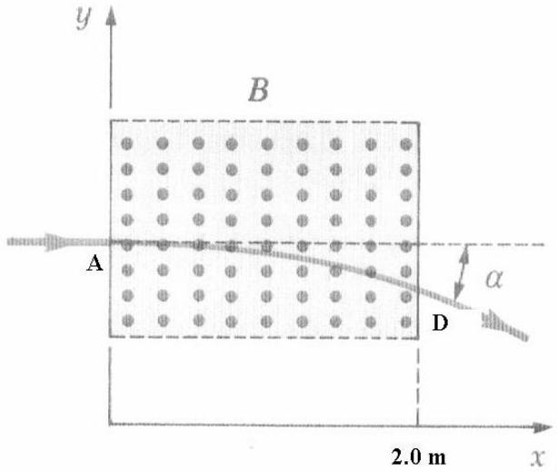

8. (a) Two identical sound sources A and B which emit sound waves with frequency 256Hz are initially side by side together with a stationary observer. Source A remains stationary with respect to the observer, while source B accelerates from rest with a constant acceleration of $0.5 \mathrm{~ms}^{-2}$ until it reaches a point P. After this, B continues to move with a constant velocity that it attains at the point P. When this happens, the observer finds that the frequency of sound coming source B differs from that from source A by 8 Hz. What is the distance of the point P from the observer? [Speed of sound waves in air $=330 \mathrm{~ms}^{-1}$ ] [5 marks]

(b)
Fig. 1

A beam of proton with kinetic energy 10 MeV is travelling in the positive $x$-direction. It enters a magnetic field of magnitude 1.5 T and the direction of the magnetic field is in the positive $z$-direction. The magnetic field extends from $x=0$ to $x=2.0 \mathrm{~m}$ as shown in Fig. 1. Determine the angle $\alpha$ between the initial velocity vector of the proton beam and the velocity vector after the beam emerges from the magnetic field. [7 marks]
