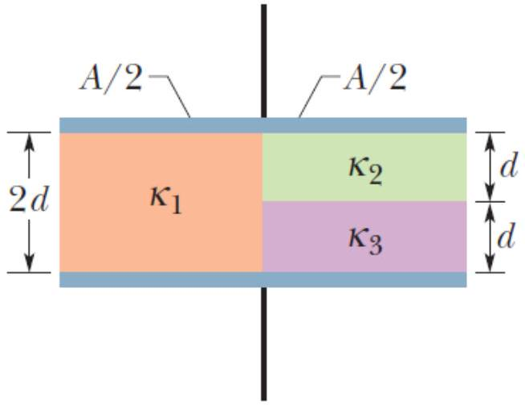

1. A parallel-plate capacitor is shown in the diagram with plate area of $A=10.5 \mathrm{~cm}^{2}$ and plate separation $2 d=7.12 \mathrm{~mm}$. The left half of the gap is filled with material of dielectric constant $\kappa_{1}=21.0$; the top of the right half is filled with material of dielectric constant $\kappa_{2}=$ 42.0; the bottom of the right half is filled with material of dielectric constant $\kappa_{3}=58.0$. What is the capacitance?
[4 marks]

