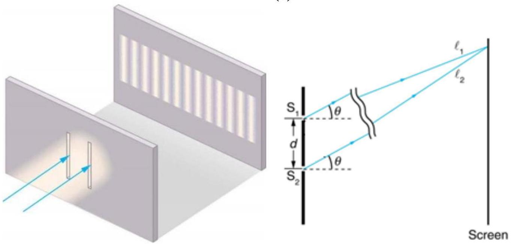

10. Consider Young's double slit experiment as shown in the below figure (a). Monochromatic light is being used. Further assume that the screen distance $\ell$ is much larger than the slit separation $d$ (Figure (b)).
(a) 
(a) Under what condition does Young's experiment show interference pattern? [0.5 marks]
(b) Determine the conditions for obtaining constructive and destructive interference. [2 marks]
(c) Determine the distance $\Delta y$ between adjacent fringes (maxima), assuming that $\theta$ (Figure (b)) is small.
[2 marks]
(d) Determine the intensity $I$ of the diffraction pattern's maxima. You may use $\sin \alpha+\sin \beta=2 \cos \frac{1}{2}(\alpha-\beta) \sin \frac{1}{2}(\alpha+\beta)$.
[4.5 marks]

## GENERAL INFORMATION SHEET

| Acceleration due to gravity at Earth surface, | $g=9.80 \mathrm{~m} \mathrm{~s}^{-2}=\|\vec{g}\|$ |
| :--- | :--- |
| Radius of the Earth | $R_{E}=6.371 \times 10^{6} \mathrm{~m}$ |
| Universal gas constant, | $R=8.31 \mathrm{~J} \mathrm{~mol}^{-1} \mathrm{~K}^{-1}$ |
| Vacuum permittivity, | $\varepsilon_{0}=8.85 \times 10^{-12} \mathrm{C}^{2} \mathrm{~N}^{-1} \mathrm{~m}^{-2}$ |
| Vacuum permeability, | $\mu_{0}=4 \pi \times 10^{-7} \mathrm{TmA}^{-1}$ |
| Atomic mass unit, | $u=1.66 \times 10^{-27} \mathrm{~kg}$ |
| Speed of light in vacuum, | $c=3.00 \times 10^{8} \mathrm{~m} \mathrm{~s}^{-1}$ |
| Charge of electron, | $e=1.60 \times 10^{-19} \mathrm{C}$ |
| Planck's constant, | $h=6.63 \times 10^{-34} \mathrm{~J} \mathrm{~s}$ |
| Mass of electron, | $m_{e}=9.11 \times 10^{-31} \mathrm{~kg}=0.000549 u$ |
| Mass of proton, | $m_{p}=1.67 \times 10^{-27} \mathrm{~kg}=1.007 u$ |
| Rest mass of alpha particle, | $m_{\alpha}=4.003 \mathrm{u}$ |
| Boltzmann constant, | $k=1.38 \times 10^{-23} \mathrm{~J} \mathrm{~K}^{-1}$ |
| Avogadro's number, | $N_{A}=6.02 \times 10^{23} \mathrm{~mol}^{-1}$ |
| Standard atmosphere pressure, | $P_{0}=1.01 \times 10^{5} \mathrm{~Pa}$ |
| Density of water, | $\rho_{w}=1000 \mathrm{~kg} \mathrm{~m}^{-3}$ |
| Specific heat (capacity) of water, | $c_{w}=4.19 \times 10^{3} \mathrm{~J} \mathrm{~kg}^{-1} \mathrm{~K}^{-1}$ |
| Latent heat of fusion for water, | $L_{f}=3.34 \times 10^{5} \mathrm{~J} \mathrm{~kg}^{-1}$ |
| Stefan-Boltzmann constant, | $\sigma=5.67 \times 10^{-8} \mathrm{~W} \mathrm{~m}^{-2} \mathrm{~K}^{-4}$ |
| Sum of N terms in an arithmetic series, | $\sum_{k=0}^{N} a_{k}+(k-1) d=\frac{N}{2}\left[2 a_{0}+(N-1) d\right]$ |
| Sum of N terms in a geometric series, | $\sum_{k=0}^{N} r^{k}=\frac{1-r^{N}}{1-r}$ |
| Approximation for square root, for small $x$ | $\sqrt{1+x} \approx 1+\frac{x}{2}$ |
