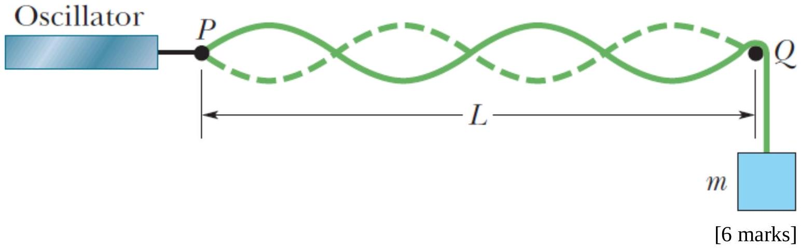

5. In the figure shown, a string, tied to a sinusoidal oscillator at $P$ and running over a support at $Q$, is stretched by a block of mass $m$. The separation $L$ between $P$ and $Q$ is 1.20 m, and the frequency $f$ of the oscillator is fixed at 120 Hz. The amplitude of the motion at $P$ is small enough for that point to be considered a node. A node also exists at $Q$. A standing wave appears when the mass of the hanging block is 286.1 g or 447.0 g, but not for any intermediate mass. What is the linear density of the string?

