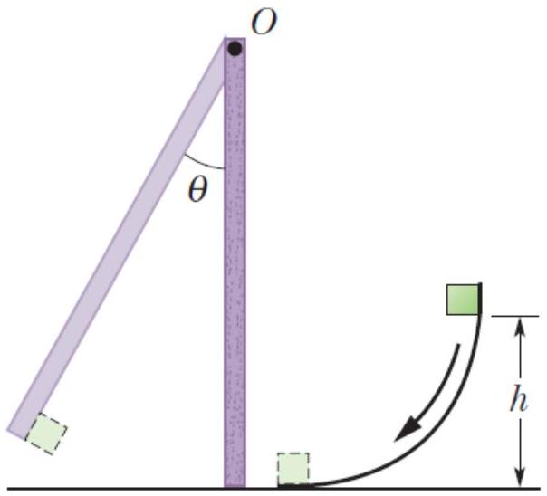

7. A small 50 g block slides down a frictionless surface through height $h=20 \mathrm{~cm}$ and then sticks to a uniform rod of mass 100 g and length 40 cm. The rod pivots about point $O$ through angle $\theta$ before momentarily stopping. Find $\theta$.
[10 marks]

