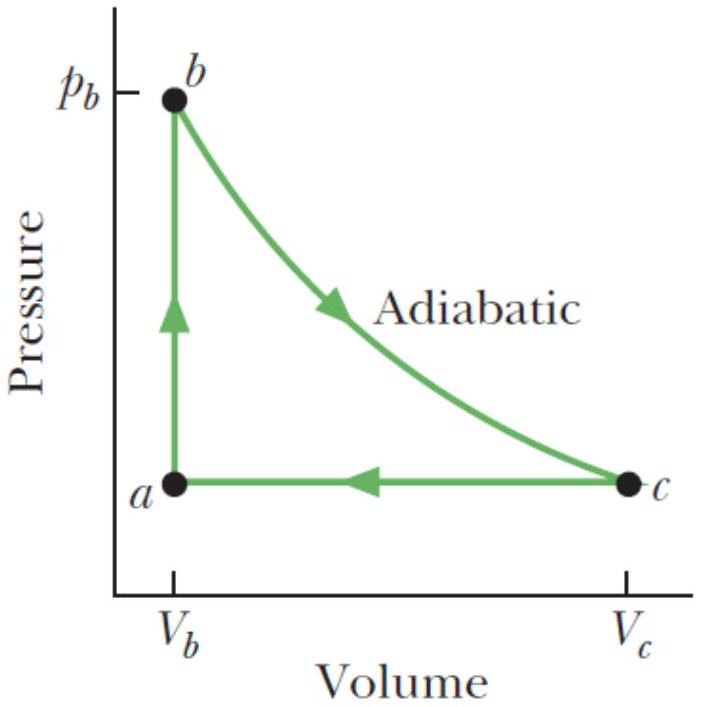

8. The figure shows a reversible cycle through which 1.00 mol of a monatomic ideal gas is taken. Volume $V_{c}=8.00 V_{b}$. Process $b c$ is an adiabatic expansion, with $p_{b}=10.0 \mathrm{~atm}$ and $V_{b}=1.00^{*} 10^{-3} \mathrm{~m}^{3}$. For the cycle, find
(a) the energy added to the gas as heat, [3 marks]
(b) the energy leaving the gas as heat, [3 marks]
(c) the net work done by the gas, and [1 mark]
(d) the efficiency of the cycle. [1 mark]

