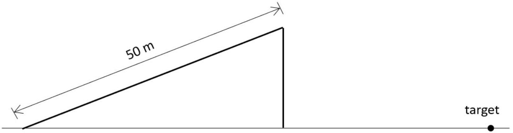

1. (a) A particle is projected with speed $u$ up a smooth inclined plane with inclination of 30° to the horizontal. It travels for 50 m along a line of greatest slope before reaching the top of the inclined plane. After leaving the inclined plane, it travels in a curved path before hitting a target which is at the same horizontal level as the base of the inclined plane and at a distance 153.3 m from the vertical face of the inclined plane. Calculate the value of $u$.
[5 marks]
1. (b) Consider the case where the surface of the inclined plane is not smooth. The coefficient of kinetic friction between the particle and the inclined plane is 0.25 . What percentage change in the value of $u$ will make the particle strike the target again after leaving the top of the inclined plane?
[5 marks]

Index no. $\_\_\_\_$
