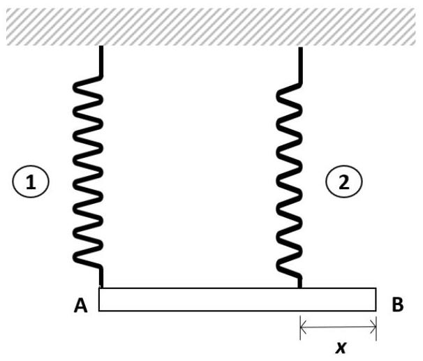
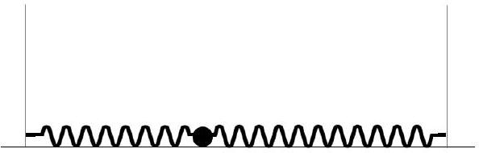

2. (a) A wire is mounted on a sounding board and has a tension of $F_{1}$. When it is set into vibration in the fundamental mode, the sound waves produce a beat with frequency 5 Hz with a 256-Hz tuning fork. When the tension in the wire is increased to $F_{2}$, the beat frequency produced by the sound waves in the fundamental mode becomes 3 Hz with the tuning fork. Find the ratio $\frac{F_{2}}{F_{1}}$.
$\_\_\_\_$
[4 marks]
2. (b) (i) A uniform bar AB of length 60 cm and weight 20 N is suspended by two springs 1 and 2. Spring 1 has a force constant of $30 \mathrm{Nm}^{-1}$ while the force constant of spring 2 is $50 \mathrm{Nm}^{-1}$. Both springs have a length of 20 cm when they are not stretched. Spring 1 is attached to the end A of the bar and spring 2 is attached to a point on the bar at a distance $x$ from end B of the bar as shown in Fig. 1. What is the value of $x$ so that the bar can remain horizontal while in equilibrium?

Fig. 1.

(ii) The two springs are now attached to two vertical walls at 50 cm apart. A small particle of mass 50 g is attached to the free ends of both springs as shown in Fig. 2. The particle can move over a smooth horizontal surface between the two walls.

Fig. 2.
