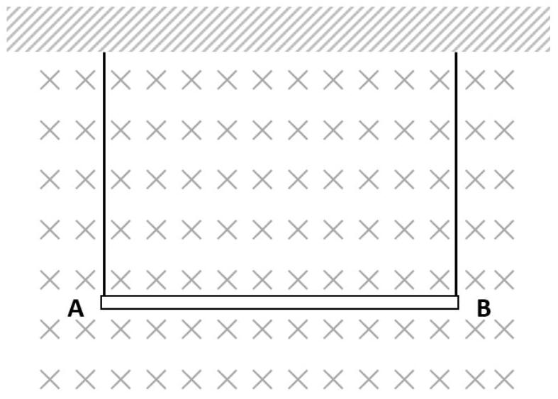

3. (a) A uniform thin wire XY is suspended by two inelastic strings attached to its end. The wire has a mass of 20 g and its resistance is $1.2 \Omega$. The length of the wire is 50 cm. The wire and the supporting strings are placed in a region where there is a uniform magnetic field of magnitude 40 mT and direction perpendicular to the plane containing the strings and the wire, as shown in Fig. 3. What is the direction and magnitude of the potential difference that must be applied to the wire so that the tension in the strings becomes zero?

Fig. 3.

[4 marks]
3. (b) The surface charge density $\sigma(r)$ at a point on a circular thin disc, having diameter 20 cm, can be described by the equation $\sigma(r)=+1.05 r \mu C \mathrm{~m}^{-2}$ where $r$ is the distance of the point from the centre of the disc. A point charge of +10nC is placed on the axis of the disc and at a distance 50 cm from the centre of the disc. What is the magnitude and direction of the electrostatic force acting on this point charge due to the positive charge on the disc?
[7 marks]
[For a uniformly charged ring with radius $R$, and carrying a total charge of $+Q$, the electric field on the axial point, at a distance $x$ from the centre of the ring is $\vec{E}=\frac{Q}{4 \pi \varepsilon_{0}} \frac{x}{\left(R^{2}+x^{2}\right)^{\frac{3}{2}}} \hat{i}$ where $\hat{i}$ is a unit vector along the axis of the ring and pointing away from the centre of the ring].

$\_\_\_\_$
