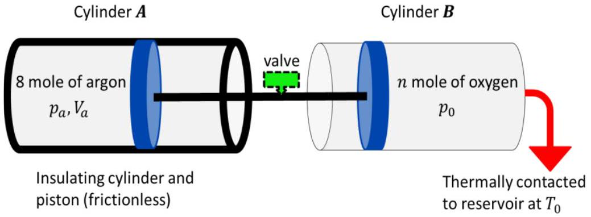

4. (a) A spherical blackbody has a radius of 30 cm and is placed in a constant temperature environment having temperature 20 °C. The blackbody is heated by an internal heater which has a heating power of 1.8 kW.
    (i) What is the maximum temperature which the blackbody can attain?
        (ii) After attaining the maximum temperature, the internal heater is switched off. If the density of the material of the blackbody is $8940 \mathrm{kgm}^{-3}$ and its specific heat capacity is $389 \mathrm{~J} \mathrm{~kg}^{-1} \mathrm{~K}^{-1}$, what is the initial rate of fall of temperature of the blackbody?

[6 marks]

4 (b) Cylinder $A$ and its piston are thermally insulated from the surrounding and cylinder $B$ is in thermal contact with a heat reservoir at a constant temperature of $T_{0}$. The two frictionless pistons are rigidly connected by a thin hollow rod (with negligible volume) and a valve that is closed. Initially, the piston of cylinder $A$ is fixed, and inside the cylinder it consists 8 moles of monoatomic argon gas at a pressure $p_{a}$ higher than atmospheric pressure $p_{0}\left(p_{a}>p_{0}\right)$ and volume $V_{a}$. Inside cylinder $B$, there is an unknown amount ( $n$ moles) of diatomic oxygen gas at atmospheric pressure $p_{0}$. When the piston of cylinder $A$ is freed, it moves very slowly until equilibrium is achieved with the volume of the argon gas being 8 times higher, and the density of the oxygen has increased by a factor of two. The heat reservoir receives heat transfer of $|Q|$ during the process.

    (i) Show that the change of the pressure and temperature of the argon are given by
$$
\Delta p=-62 p_{0} \quad ; \quad \Delta T=-\frac{3}{4} T_{a}
$$
where $p_{0}$ is the atmospheric pressure and $T_{a}$ is the initial temperature of the argon.
    (ii) Finally, the valve on the thin hollow rod is opened. Calculate the final pressure of the mixture of the gases and express it in terms of $|Q|, T_{0}$ and $V_{a}$.
$\_\_\_\_$
[6 marks]

Index no. $\_\_\_\_$

5 (a) A cube lies with one of its faces on the $x-y$ plane and three of its edges along the $x, y \& z$ axes. The cube starts to slide horizontally along the $x$-axis with constant speed $v$. It is found that as a result of the motion, the density of the material of the cube appears to increase by 25\%. Calculate the value of $v$.

Index no. $\_\_\_\_$ SPhO 2022 Theory Paper 2
[4 marks]

(b) An observer in the Earth frame observes two spaceships A and B pass each other in opposite directions. In the inertial frame in which both spaceships are at rest, the lengths of spaceship A and spaceship B are 200 m and 150 m respectively. The observer in the Earth frame measures that the speed of spaceship A is $0.8 c$ and that of spaceship B is $0.6 c$. As measured by this observer, what is the time interval between the instant when the nose of spaceship A passes the nose of spaceship B and the instant when the tail of spaceship A passes the tail of spaceship B? What is the corresponding time interval measured by an observer sitting at the nose of spaceship A?

[6 marks]
