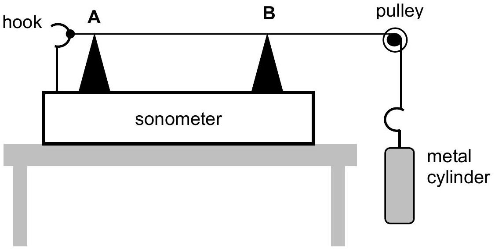

2. (a) Fig. 1 shows a schematic diagram of a sonometer which is an instrument for studying the properties of transverse stationary waves in a stretched string.

Fig. 1.

The string can be vibrated using an electrical vibrator. Stationary waves can be formed in the portion of the string between the two wedges (labelled A and B in Fig. 1). The tension in the string is provided by a metal cylinder hanging from one end of the string as in Fig. 1. In a particular experiment, the mass of the cylinder is 2.0 kg. The string has a circular cross-section with uniform diameter of 1.5 mm and the density of the material of the string is $8830 \mathrm{~kg} \mathrm{~m}^{-3}$. The string is vibrating in its fundamental mode with a frequency of 22.0 Hz. What is the distance between the two wedges?
[2 marks]

2. (b) The metal cylinder has a density $8400 \mathrm{~kg} \mathrm{~m}^{-3}$ and a diameter of 5.0 cm. While still hanging from the end of sonometer wire, the cylinder is completely immersed in water. What changes must be made to the distance between the two wedges so that the frequency of fundamental mode still remains at 22.0 Hz?
$\left[\right.$ Density of water $\left.=1000 \mathrm{~kg} \mathrm{~m}^{-3}\right]$
[4 marks]

2. (c) The distance between the two wedges is now adjusted back to the value as calculated in part 2(a). The metal cylinder is now immersed in brine which has a density of $1220 \mathrm{~kg} \mathrm{~m}^{-3}$. The string is now allowed to vibrate in the second overtone mode. The sound waves produced by the string and the sound waves from a piano note of frequency 64 Hz are sounded together. What is the frequency of the beat produced?
[4 marks]
