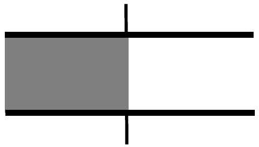

3. (a) A parallel plate capacitor with the space between the plates filled with air has a capacitance of $6 \mu F$. It is charged by connecting to a 24 -volt battery. With the capacitor still connected to the battery, an insulating material having dielectric constant of 2.5 is inserted into the space between the plates of the capacitor so that it fills exactly 50\% of the space (see Fig. 2). Calculate the amount of charge flowing through the battery during the process (i.e., from the instant the insulating material is inserted to when it fills up 50\% of the space).

Fig. 2.

[5 marks]

3. (b) A thin rod, AB, of negligible mass and length 60 cm is suspended at its ends by two identical springs each with a force constant of $20 \mathrm{Nm}^{-1}$. The rod is charged and the linear charge density at a point on the rod distance $x$ from A is $0.9 x$. The rod and the springs are placed in a uniform electric field of magnitude $24 \mathrm{Vm}^{-1}$ and directed vertically downwards. What is the inclination of the rod to the horizontal when the system is in equilibrium? Assume that the springs remain vertical when the rod is inclined.
[6 marks]
