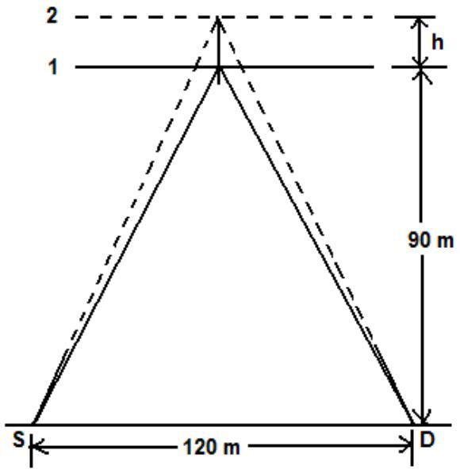

2. (a) Two satellites $X$ and $Y$ are orbiting around Earth in circular orbits above the equator (or co-centre with the equator). The orbit of $X$ is 500 km above the surface of Earth while that of $Y$ is 1000 km above the surface Earth. At a particular instant, both satellites are vertically above a point on the surface of Earth. After $t$ minutes, they are found to be vertically above another point on the surface of Earth. Determine the value of $t$, taking the radius of Earth to be 6360 km.
[3 marks]

2. (b) A sound source $S$ and a detector $D$ are placed at a distance of 120 m apart as shown in Fig. 1. The source $S$ produces sound waves with wavelength 1.33 m . A reflector is placed so that its plane is parallel to the line joining $S$ and $D$. When the reflector is situated at position 1 (see Fig.1), the direct wave from $S$ is found to be in phase at the detector $D$ with the wave from $S$ that is reflected from the reflector. The incident and reflected waves make the same angle with the reflector. When the reflector is moved slowly away from position 1, the sound detected at $D$ decreases in intensity and becomes zero for the first time when the detector reaches position 2 that is at a distance $h$ from position 1. Determine the value of $h$.

Fig. 1.

[6 marks]
