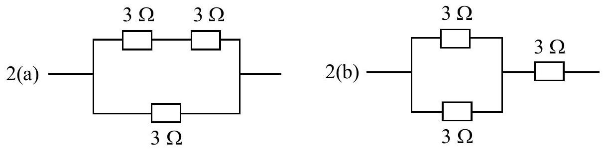

3. (a) Three resistors, each of value $3 \Omega$, are arranged in two different arrangements as shown in Fig. 2. If the maximum allowable power for each individual resistor is 108 W, calculate the maximum power that can be dissipated by the circuits shown in Fig. 2(a) and 2(b).

Fig. 2.

[4 marks]

3. (b) An insulating sphere with a diameter of 1.0 m carries a uniform charge density of $5 \mathrm{nC} \mathrm{m}^{-3}$ throughout its entire volume. A small tunnel is drilled along a diameter of the sphere. A small particle with mass $1.0 \mu g$ and carrying charge -0.05 nC is placed at one end of the tunnel and released. Calculate:
    (i) the time taken by the particle to move to the other end of the tunnel.
    (ii) the speed of the particle when it reaches the centre of the sphere.
