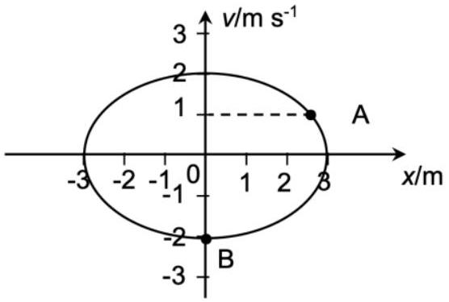
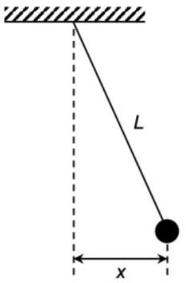

1. (a)(i) Figure 1.1 shows how the velocity $v /\left(\mathrm{ms}^{-1}\right)$ varies with the displacement $x / \mathrm{m}$ for a particle undergoing simple harmonic motion.

Figure 1.1

Determine the period of the motion. [2 marks]

    (a) (ii) Calculate the time taken for the particle to move from the state represented by the point A to the state represented by the point B. [2 marks]

$\_\_\_\_$

(b) (i) By using the expression $v= \pm \omega \sqrt{x_{0}^{2}-x^{2}}$, show that the potential energy $E$ of a particle of mass $m$ undergoing simple harmonic motion of angular frequency $\omega$ is given by $E=\frac{1}{2} m \omega^{2} x^{2}$. [3 marks]
(b)(ii) Figure 1.2 shows a pendulum bob of mass $m$ suspended from a string of length $L$.

Figure 1.2

Show that the potential energy $E$ of the pendulum is given by (with respect to the equilibrium position, $E=m g L-m g \sqrt{L^{2}-x^{2}}$. [1 mark]

Index no. $\_\_\_\_$

(b) (iii) By combining the results of (b)(i) and (b)(ii), show that the period of a pendulum of length $L$ is $2 \pi \sqrt{\frac{L}{g}}$ for small-angle oscillations. [2 marks]

Index no. $\_\_\_\_$
