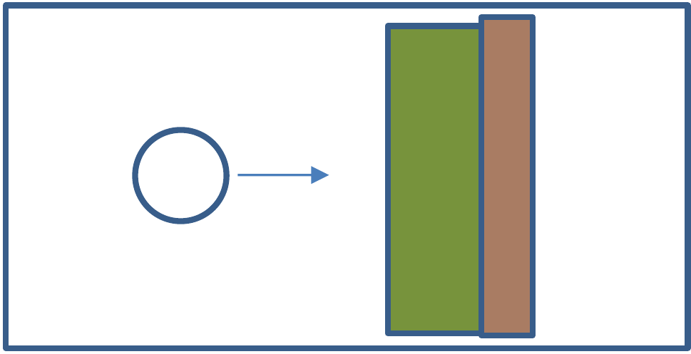
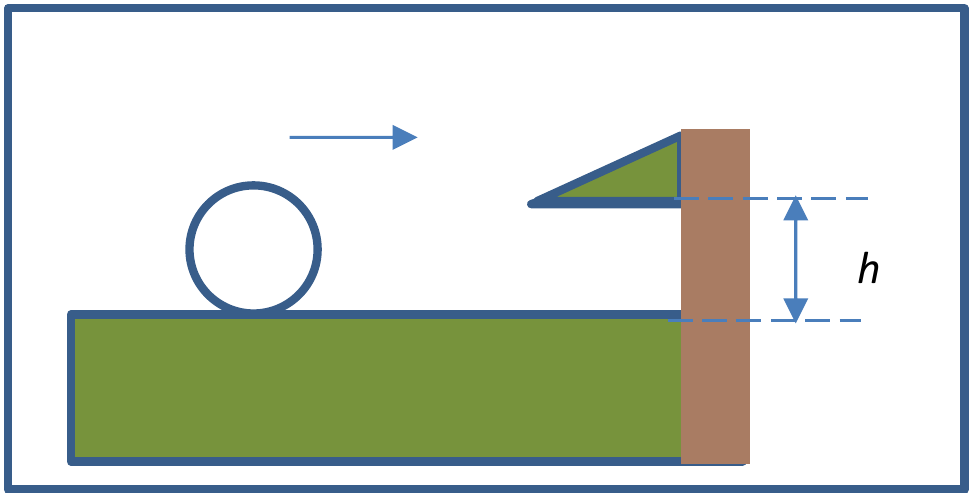

Question 1 – Billiards [5]

A billiard ball, a hard sphere of uniform density, has mass $m$ and radius $r$. It rolls without slipping on a felt-lined billiard table. The ball moves directly towards the edge of the table, and hits the overhang (see Fig 1.1 and Fig 1.2).

Determine the height $h$ of the overhang, such that the ball rolls without slipping immediately after the collision. State and explain any additional assumptions required.

{You may wish to note that the moment of inertia for a thin spherical shell of mass $M$ and radius $R$ about an axis through its centre is $\frac{2}{3}MR^2$.}

[5 marks]

Figure 1.1: Top view of billiard ball rolling towards the edge of the table

Figure 1.2: Side view of billiard ball rolling towards the edge of the table
