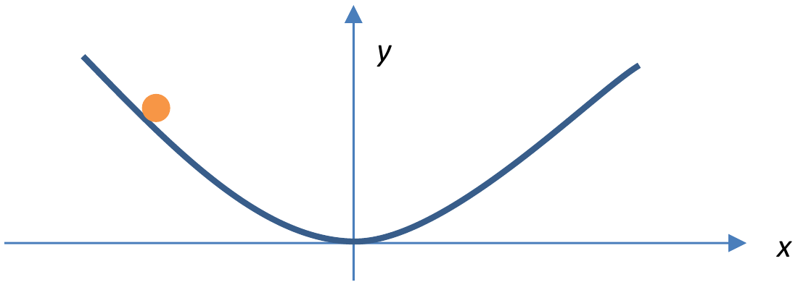

Question 2 – Oscillations [15]

A point object, mass $m$, slides on a frictionless parabolic curve, in a uniform gravitational field $g$. The curve shown in Fig 2.1 has the equation $y = \dfrac{x^2}{L}$, where $L$ is a constant.

Figure 2.1: Point object sliding on a frictionless parabolic curve

(a)(i) Derive an expression for the total energy $E_{parabolic}$ of the point object, as a function only of $x$ and $\dot{x}$, the time derivative of $x$.

[3 marks]

(a)(ii) Show that the motion of the point object is only **approximately** simple harmonic, and find the period $T_{approx}$.

[3 marks]

Instead of the frictionless parabolic curve, we want to find the frictionless tautochrone[^1] curve, on which a point object will oscillate with the same period regardless of where it is released from (i.e. period independent of amplitude, just like for a simple harmonic oscillator).

Let this period of oscillation be $T_0$.

(b)(i) Define the arc length $s$ as a variable that gives the distance along the curve from the origin. Derive an expression for the total energy $E_{tautochrone}$ of the point object, written as a function only of $s$ and $\dot{s}$, the time derivative of $s$. {Hint: If you get stuck, some dimensional analysis might be helpful and could even gain you some marks!}

[4 marks]

(b)(ii) Deduce the parametric equations defining the tautochrone curve, i.e. the expressions $x(\theta), y(\theta)$ where the angle $\theta$ is related to the slope of the curve, i.e. $\tan\theta = \dfrac{dy}{dx}$.

[5 marks]

[^1]: The Greek tauto- means "same" (e.g., tautology), while chrone means "time" (e.g., chronology).
