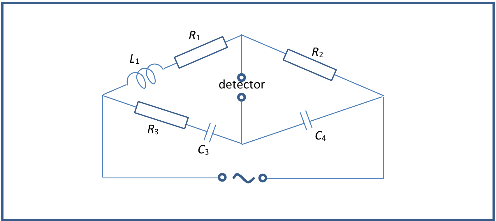

Question 4 – Balance [5]

Determine the necessary and sufficient conditions for the detector in the circuit diagram Fig 4.1 to pick up zero signal, for an alternating voltage with peak amplitude $V_0$ and angular frequency $\omega$. Comment on your answer.

[5 marks]

Figure 4.1: Circuit diagram with detector (bridge: arm $L_1$ in series with $R_1$; arm $R_2$; arm $R_3$ in series with $C_3$; arm $C_4$; detector between the two middle nodes; AC source across the bridge)
