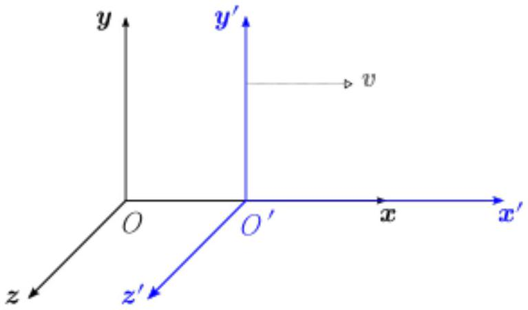

## Question 5 - Relativistic Doppler [10]

Frame $\mathrm{S}^{\prime}$ moves with velocity $v$ relative to the inertial frame S, as shown in Fig 5.1. The coordinates in S and S' are ( $x, t$ ) and ( $x^{\prime}, t^{\prime}$ ) respectively. The velocity $v$ is in the positive $x$-direction, and is less than the speed of light $c$.

At $t=t^{\prime}=0$, we have $x=x^{\prime}=0$, such that the origins O and O' of the coordinate frames coincide.

Figure 5.1: Inertial frames of reference $S$ and $S^{\prime}$

There is a wave source fixed at the origin O of the frame S. The source produces waves of frequency $f$ and speed $u$, as measured by Alice, an observer (at rest) in frame S.

Bob is an observer (at rest) in frame $S^{\prime}$.
Alice notices that the wave source produces a pulse at $\left(x_{1}, t_{1}\right)=(0,0)$.

(a) What are the coordinates $\left(x_{1}{ }^{\prime}, t_{1}{ }^{\prime}\right)$ of this event according to Bob?

[1 mark]

Alice notices the next pulse from the source at $\left(x_{2}, t_{2}\right)=(0, T)$.

(b) (i) Write down an expression for $T$.

[1 mark]
(b)(ii) What are the coordinates $\left(x_{2}^{\prime}, t_{2}^{\prime}\right)$ of this event according to Bob?
[2 marks]

For Bob to judge the frequency of the wave source from his frame of reference, he can calculate the time interval between the two pulses.
(c)(i) What is the speed $u^{\prime}$ of the wave according to Bob?
[1 mark]

(c) (ii) Show that the frequency as determined by Bob is
$$
f^{\prime}=f \cdot\left(1-\frac{v}{u}\right) \cdot\left(1-\frac{v^{2}}{c^{2}}\right)^{-1 / 2}
$$
(Equation 5.1)
[3 marks]
(c) (iii) Explain how to obtain, from Eqn 5.1, the expression for the relativistic Doppler shift for electromagnetic waves.

[1 mark]

(c) (iv) What does the $c \rightarrow \infty$ limit of Eqn 5.1 correspond to?

[1 mark]
