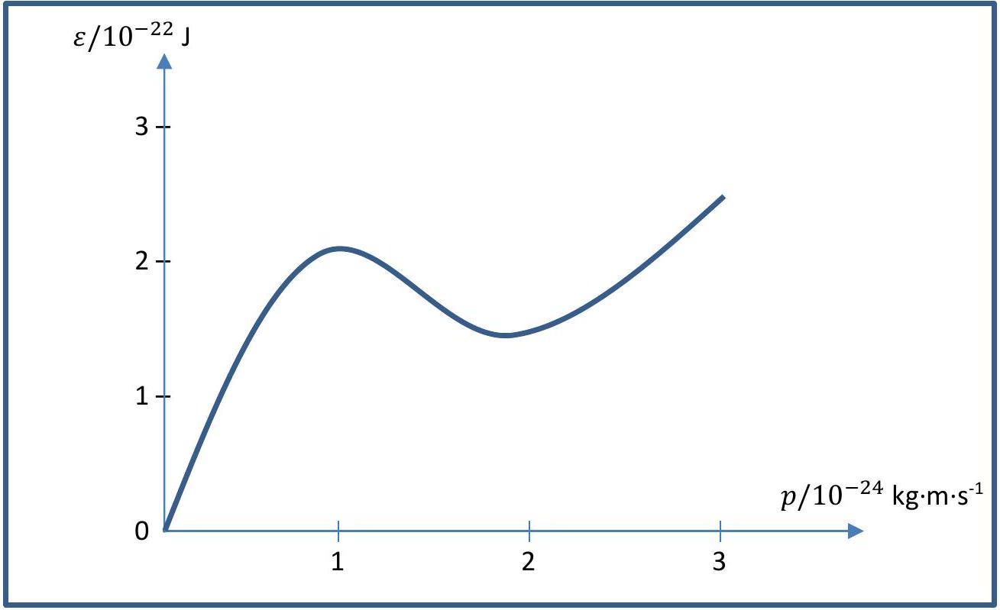

## Question 6 - Superfluid [10]

In a superfluid phase, particles move with zero viscosity. In this question, we explore a theoretical model, due to Lev Landau (1962 Nobel Prize in Physics), for how drag forces can be absent in a superfluid. The basic insight is that if the particles do not interact, then there is no dissipation or drag.

We describe an analogy, to help make clearer ${ }^{2}$ what you are asked to imagine. A neutron travelling through the quantum vacuum might "interact" with the vacuum to decay into a proton and an electron (and a neutrino). For a microscopic particle travelling in a fluid, assume that the interaction of the particle with the fluid produces a quasiparticle ${ }^{3}$, which you should treat as a regular particle.

Let the microscopic particle travelling in the fluid have mass $M$, and velocity $\underline{\boldsymbol{u}}$ and $\underline{\boldsymbol{v}}$ respectively before and after the interaction with the fluid. Let the energy and momentum of the quasiparticle produced be denoted by $\varepsilon$ and $\boldsymbol{p}$ respectively. Note that the underlined quantities indicate vectors.

(a) Write down equation(s) relating the various quantities introduced above, and justify their validity.

[2 marks]

(b) Show that the equation(s) in part (a) can only be satisfied if
$$
u>\min _{p} \frac{\varepsilon(p)}{p}
$$
where $u=|\underline{\boldsymbol{u}}|$ and $p=|\underline{\boldsymbol{p}}|$.

[3 marks]

[^1](c)(i) By considering that the microscopic particle could in fact be a fluid particle, discuss how to obtain a "superfluid criterion" to decide whether a system is in the superfluid phase or not, based on the quasiparticle dispersion $\varepsilon(p)$.
[1 mark]

(c)(ii) Apply this criterion to a system where the quasiparticles of mass $m$ obey:

    1. the free particle spectrum $\varepsilon=\frac{p^{2}}{2 m}$

[1 mark]

2. the so-called Bogoliubov spectrum $\varepsilon=p \sqrt{c^{2}+\frac{p^{2}}{4 m^{2}}}$

[1 mark]

3. the spectrum for liquid helium-4 at a temperature of 2.0 K, shown in Fig 6.1

[2 marks]

Figure 6.1: Quasiparticle dispersion for helium-4 at 2.0 K
