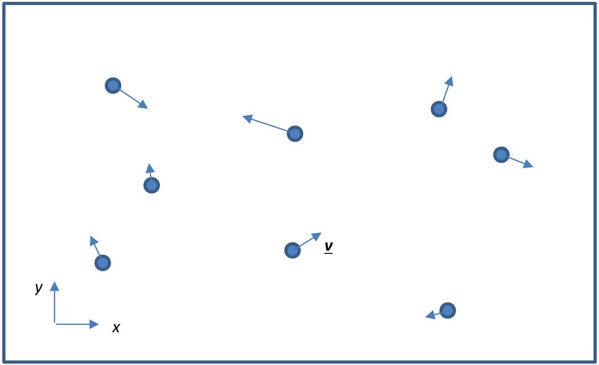

## Question 7 - Cooling [20]

Consider a monatomic ideal gas in two spatial dimensions, constrained in a "box" of area $A$, as shown in Fig 7.1. Each atom has mass $m$. The number of atoms in the gas is $N$, and the temperature of the gas is $T$.

Figure 7.1: Two dimensional monatomic ideal gas

(a)(i) Explain clearly why the infinitesimal probability $d^{2} P\left(v_{x}, v_{y}\right)$ for an atom to have the velocity in the range $\left(\left[v_{x}, v_{x}+d v_{x}\right],\left[v_{y}, v_{y}+d v_{y}\right]\right)$ is given by

$$
d^{2} P\left(v_{x}, v_{y}\right)=C \exp \left(-\frac{m\left(v_{x}^{2}+v_{y}^{2}\right)}{2 k_{B} T}\right) d v_{x} d v_{y}
$$

[2 marks]
(a)(ii) And determine an expression for $C$. \{Hint: You may use the identity $\int_{-\infty}^{\infty} e^{-x^{2}} d x=\sqrt{\pi}$.\}
[2 marks]
(a)(iii) Deduce the expression for the infinitesimal probability $d P_{v}$ for an atom to have a speed between $v$ and $(v+d v)$.
[2 marks]

It is experimentally possible to rapidly (within a time-interval $\tau$ ) remove all particles with speed $v>$ $\sqrt{\frac{2 \eta k_{B} T}{m}}$, without affecting the other particles.
(b)(i) Derive an expression for the number of atoms $N^{\prime}$ left in the box after this process, as a function of the parameter $\eta$.
[2 marks]
(b)(ii) Sketch a graph to show the variation of $\frac{N^{\prime}}{N}$ against $\eta$.
[1 mark]
(b)(iii) Derive an expression for the total energy of the gas left in the box, in terms of $m, N, T, \eta$.
[2 marks]

The gas will re-thermalise after a time $t \gg \tau$, and reach a new equilibrium temperature $T^{\prime}$.
(c)(i) Explain qualitatively why cooling occurs.
[1 mark]
(c)(ii) Derive an expression for $T^{\prime}$, and show that $T^{\prime} \leq T$.
[3 marks]
(c)(iii) Sketch a graph to show the variation of $\frac{T^{\prime}}{T}$ against $\eta$.
[1 marks]

In the framework of quantum statistical mechanics, we define the phase space density

$$
\rho=\frac{N \lambda^{2}}{A}
$$

where $\lambda=\frac{h}{\sqrt{2 \pi m k_{B} T}}$ is the thermal de Broglie wavelength.
(d)(i) Derive an expression for $\rho^{\prime} / \rho$, the ratio of phase space density after the cooling process to the phase space density before cooling.
[2 marks]
(d)(ii) Sketch a graph to show the variation of $\frac{\rho^{\prime}}{\rho}$ against $\eta$.
[1 mark]
(d)(iii) Suggest the implications of phase space density on such a cooling scheme.
[1 mark]
