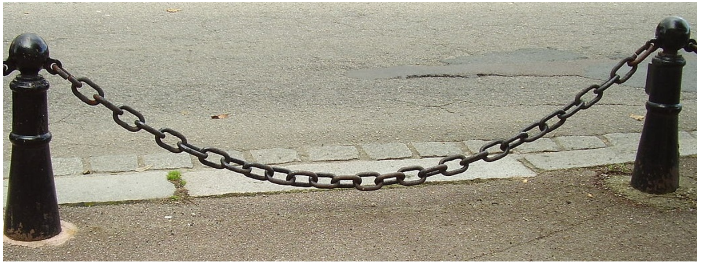
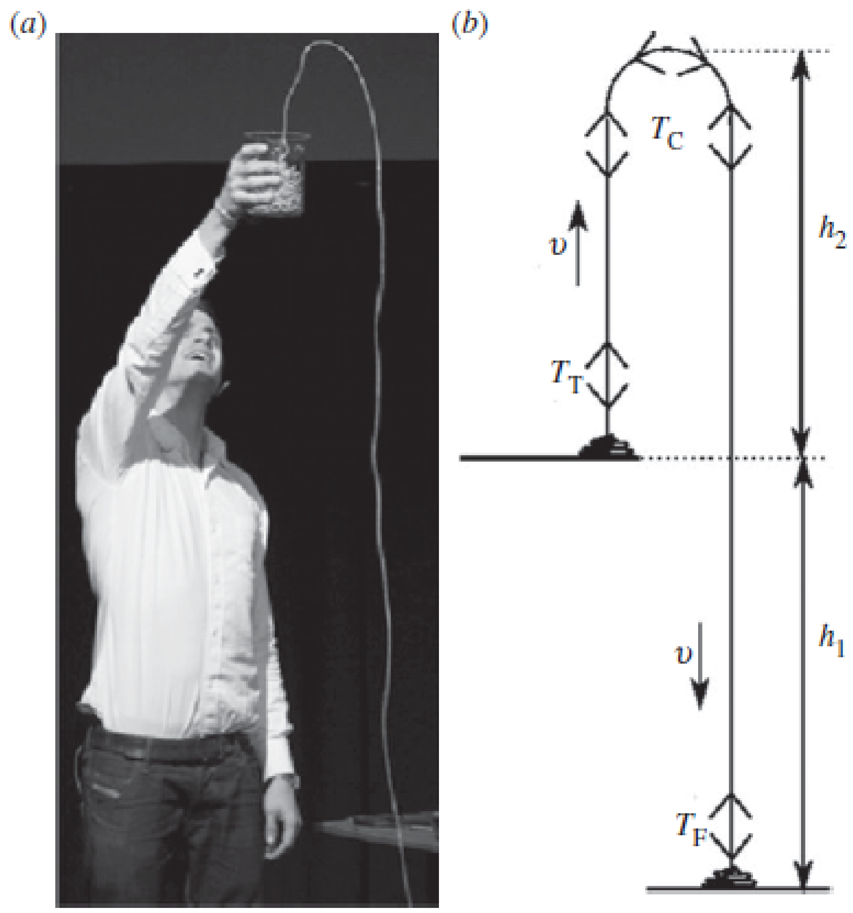
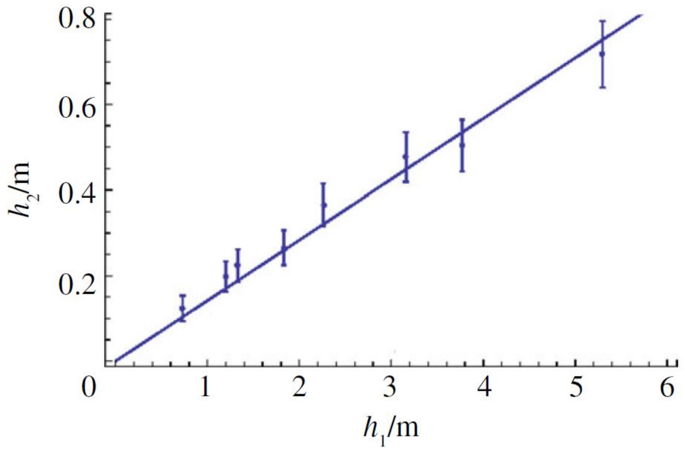

1. A chain has uniform linear mass density $\lambda$.

(a) The chain is attached at its ends to two points that are at the same horizontal level, and it hangs freely (without touching the ground) in a uniform gravitational field of strength $g$. The distance between the two points of suspension is $d$. Let $T_{0}$ denote the tension in the chain at its lowest point.

    i. Qualitatively, what happens to the value of $T_{0}$ when $d$ is reduced, assuming nothing else changes and the chain continues to hang freely? (No need to discuss the mathematical relationship between $d$ and $T_{0}$.) [1]
    ii. Denote the horizontal and vertical axes as the $x$-axis and $y$-axis respectively (let the upwards direction be positive). Derive a second-order differential equation in $y=y(x)$ that the shape of the chain must obey. [5]
    iii. Show that
$$
y=a \cosh \left(\frac{x}{a}\right)+b
$$
is a solution to the differential equation obtained, for an appropriate choice of origin for the axes. Relate the variables $a$ and $b$ to the parameters given earlier in the problem. [5]

(b) Through a siphoning mechanism, a sufficiently long chain can launch into a fountain. We consider the chain with uniform linear mass density $\lambda$ initially on an elevated surface, with one end then allowed to fall onto the ground. This is well discussed in the paper by J. S. Biggins and M. Warner, Proc. R. Soc. A **470**, 20130689 (2014), from which this question is adapted.

In this part of the problem, we start with a toy model of the phenomenon in the steady-state when the chain is moving with speed $v$. Label the tension in three regions as $T_{T}, T_{C}, T_{F}$ with the table-to-floor height $h_{1}$ and the rise height of the fountain $h_{2}$ (see figure and caption taken from Biggins and Warner).

Figure 1. (a) Mould demonstrates a chain fountain. We thank J. Sanderson for permission to reproduce this photograph. (b) Our minimal model of a chain fountain. A chain, with mass per unit length $\lambda$, is in a pile on a flat table a distance $h_{1}$ above the floor. It flows to the floor at a speed $v$ along the sketched trajectory, with $T_{\mathrm{T}}$ being the tension just above the table, $T_{\mathrm{C}}$ the tension in the small curved section at the top of the fountain and $T_{\mathrm{F}}$ the tension just above the floor.

    i. Let $r$ be the local radius of curvature for the section of the chain when it is at its highest point.
        $\alpha)$ By considering an infinitesimal section of the curved chain, derive an equation relating $T_{C}$ with $v$ and show that $T_{C}$ is independent of $r$. You may assume that $v^{2} \gg g r$. [2]
        $\beta)$ Describe the physical interpretation of the assumption that $v^{2} \gg g r$. [1]
    ii. By considering the vertically rising and falling branches of the motion, derive two separate equations relating the various tensions. [2]
    iii. By considering an infinitesimal section of the chain just as it rises from the table, derive an equation relating $T_{T}$ with $v$. [1]
    iv. Suppose also that $T_{F}=0$ because the floor provides the full force required to bring the chain to rest. Discuss what you can deduce about $h_{2}$ and $v$ for this model. [2]

(c) In this next part of the problem, we modify the model slightly to allow the table to exert a normal contact force $R=\alpha T_{C}$ on the chain as it lifts off. We also suppose $T_{F}=\beta T_{C} \geq 0$ such that the floor does not necessarily provide the full force that brings the chain to rest.

    i. Derive expressions for the ratios $h_{2} / h_{1}$ and $v^{2} / g h_{1}$ with this modification. [2]
    ii. From the experimental data below (taken from Biggins and Warner), suggest possible values for $\alpha, \beta$. [2]

[Aside: Biggins and Warner conducted rather interesting numerical simulations using long chains of springs and masses, where other than simulating the physical setup, they had a version where the table was replaced by a region of zero gravity so that chain could "float" without the possibility of a contact force $R$.]

(d) In this final part of the problem, we explore the mathematical shape of the chain fountain (moving at steady-state speed $v$).

In the case of the hanging chain in (a), the variables $x$ and $y=y(x)$ described the shape and the tension could also be found as a function $T=T(x)$.

In the case of the chain fountain, let us now parameterise using $s$, the distance (arc length) along the chain, so the tension is $T=T(s)$ and the shape can be described by the angle the chain makes with the vertical $\theta=\theta(s)$.

    i. By considering forces parallel to the chain, show that [1]
$$
\frac{d T}{d s}=\lambda g \cos \theta \;.
$$
    ii. By considering forces perpendicular to the chain, derive an equation involving functions of $T(s)$ and $\theta(s)$ and their first derivatives. [**Hint:** the local curvature is $1/r = d\theta/ds$.] [2]
    iii. For the limiting case of $v=0$, these equations describe the freely suspended chain and are solved by the hyperbolic cosine function given in the last part of (a). Discuss how the solutions for $\theta(s)$ and $T(s)$ are modified for $v \neq 0$. (Do not worry about boundary conditions. It's quite complicated and you can think about this more after the exam.) [2]

Q1 total: 28
