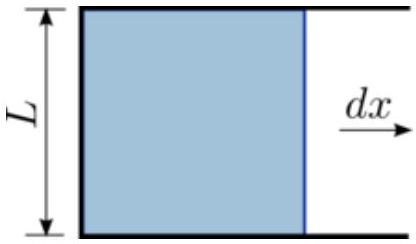

4. (a) A charged conducting ball has radius $r$ and surface charge density $\sigma$.
    i. Find its electrostatic energy $U$. Explain your reasoning carefully.
ii. By considering how $U$ changes with $r$, assuming that the total charge on the ball is constant, derive an expression for the pressure $p$ acting on the surface.

(b) The tensile strength $T$ of a material can be determined by fabricating a thin rectangular sheet with uniform thickness $\delta$ and a width $L$, then pulling on the sheet perpendicular to the width and along the direction of the sheet. $T$ can then be defined as
$$
T=\frac{F}{L \delta},
$$
where $F$ is the minimum force needed to tear the sheet apart.

    i. Show that, for a uniform spherical shell of radius $r$, the maximal pressure $p^{*}$ is related to the tensile strength $T$ by the formula
$$
p^{*}=\frac{2 T \delta}{r} .
$$
You should work from first principles and consider a small area on the surface of a sphere.
    ii. A metal is chosen to fabricate a thin spherical shell of thickness $\delta=1 \mu \mathrm{~m}$ and radius $r=0.5 \mathrm{~m}$ to act as a capacitor. Find the minimum tensile strength $T$ required such that the shell does not rupture before it discharges through the surrounding air. Assume that air breaks down at an electric field strength of $E_{0}=3 \mathrm{MV} / \mathrm{m}$.
    iii. Suppose the goal is to store a given amount of electrostatic energy, and we want to optimise for the amount of metal used. Is it better to use one large spherical shells or several smaller shells (keeping the shell thickness fixed in both cases)? Explain your answer clearly.
[Hint: separately consider the two different physical mechanisms that impose constraints on energy storage.]
