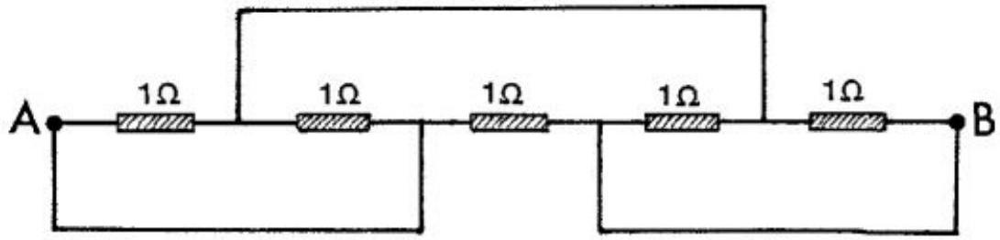
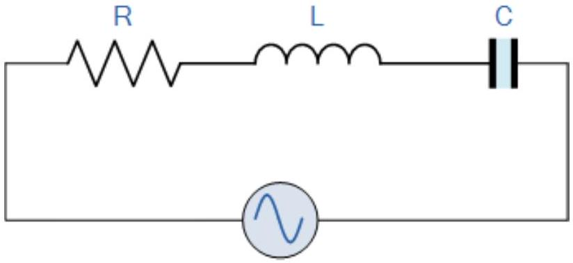

2. This question consists of short puzzles, which can be solved independently.

(a) Five $1 \Omega$ resistors are connected in a circuit as shown in the figure. Determine the resulting resistance $R$ between points A and B.

(b) A thermally insulated piece of metal is heated by an electric current at a constant power $P$. This results in the absolute temperature $T$ of the metal varying with time $t$ as follows:
$$
T(t)=T_{0}\left[1+a\left(t-t_{0}\right)\right]^{1 / 4},
$$
where $T_{0}, a$, and $t_{0}$ are constants.
Determine the heat capacity $C(T)$ of the metal for the temperature range of this experiment.
(c) An electron was accelerated from rest through a voltage of 1 MV. What is its speed $v$ and momentum $p$ ?
(d) A neutral pion is travelling with speed $v$ when it decays into two photons, which are seen to emerge at equal angles $\theta$ on either side of the original velocity. Show that $v=c \cos \theta$.
(e) In the circuit below, the input voltage is $V_{\text {in }}=V_{0} \sin (\omega t)$, where $V_{0}$ and $\omega$ are constants (peak voltage and angular frequency respectively), and $t$ is the time.

Find an expression for the peak current $I_{0}$ in terms of $R, L, C, V_{0}$, and $\omega$.
Also comment on how your answer depends on the value of $\omega$.
