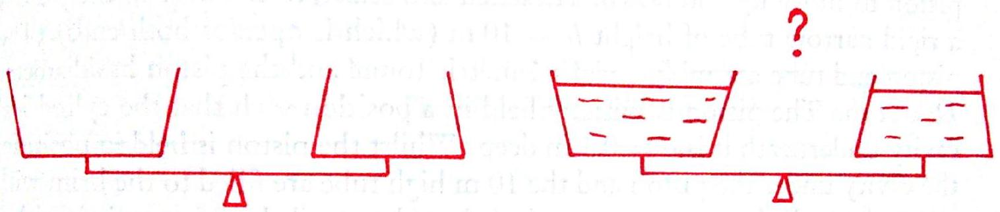
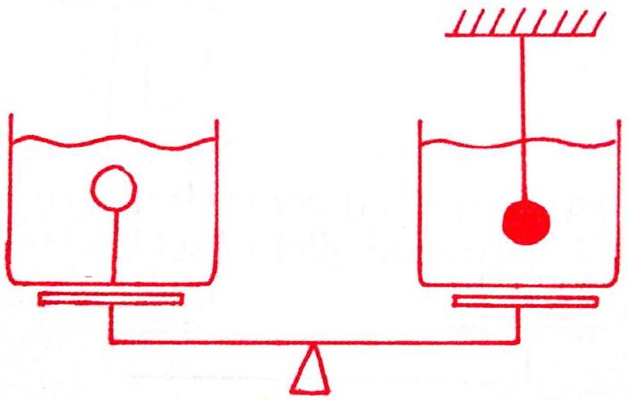

4. This question consists of a couple of puzzles involving weighing scales.

(a) A pair of scales has integrated vessels (i.e. the vessels are part of the scales themselves rather than sitting on top of the scales) of the same base area. The left vessel tapers outwards to the top, while the right vessel tapers inwards to the top.

    i. Discuss the flaw(s) in the reasoning below: "If the vessels are filled with water to the same height, the force on the base of the vessels should be the same and so the scales should remain balanced."
(b) A pair of identical vessels contain identical amounts of water. In the left vessel, a very light ball is fully submerged and attached to the base by a very light string. In the right vessel, a very heavy ball (of the same volume as the other ball) is fully submerged and attached to the ceiling by a very light string.

    i. Do the scales tip left, tip right, or stay level? Explain.
