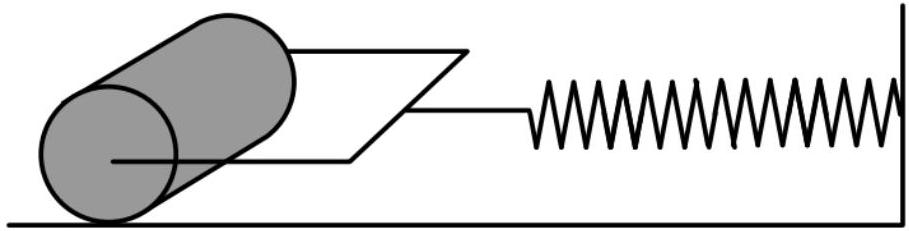

5. A roller consists of a solid uniform cylinder of mass $m$ and radius $r$. The roller is on a horizontal surface and is attached, by a ideal spring of spring constant $k$ and negligible mass, to a vertical wall. The coefficient of friction between the roller and the horizontal surface is $\mu$, and the acceleration of free fall is $g$.

    (a) If the roller performs small oscillations without slipping, show that the motion is simple harmonic and determine an expression for the period of oscillations $T$.

(b) Determine an expression for the maximum oscillation amplitude $A_{0}$ (measured by the deformation of the spring) such that the roller oscillates without slipping.
(c) If the spring is stretched to an initial amplitude $A \gg A_{0}$, estimate the maximum angular speed $\omega$ of the roller after it is released.
