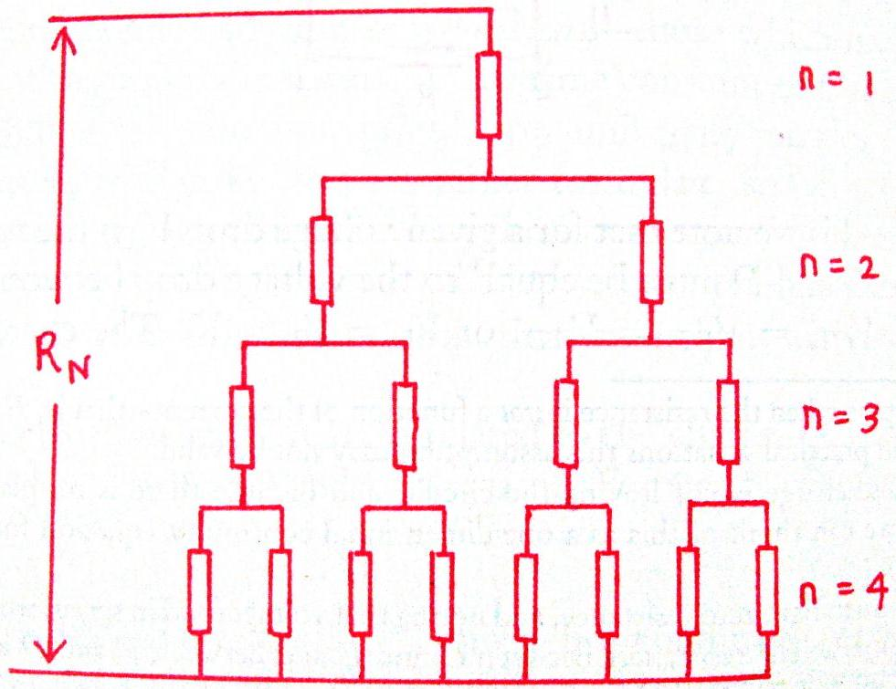
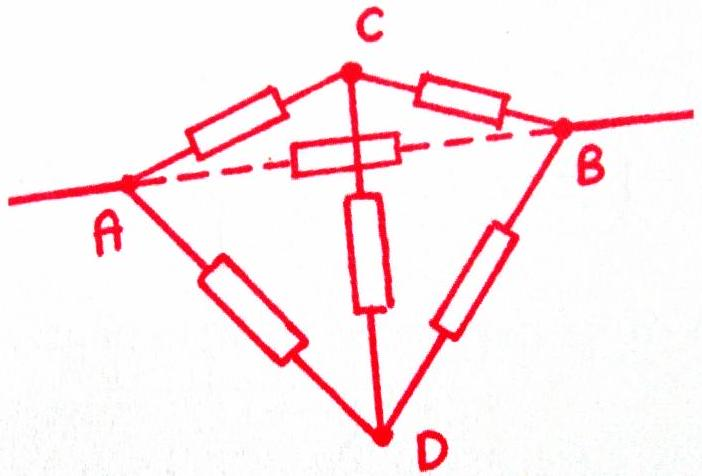

6. This question involves resistor arrangements.

(a) A resistor pyramid is built in a branched structure as shown below.

    i. If there are $N$ levels, constructed from individual resistances of value $R$, what is the equivalent resistance $R_{N}$ across the pyramid?
    ii. What is the limit $R_{\infty}$ ?
(b) A resistor tetrahedron is constructed from individual resistances of value $R$.

i. What is the equivalent resistance $R_{T}$ across any pair of vertices (corners)?
