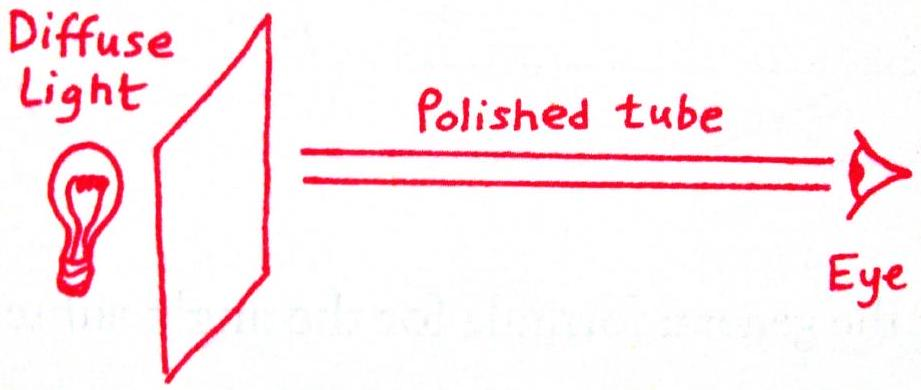
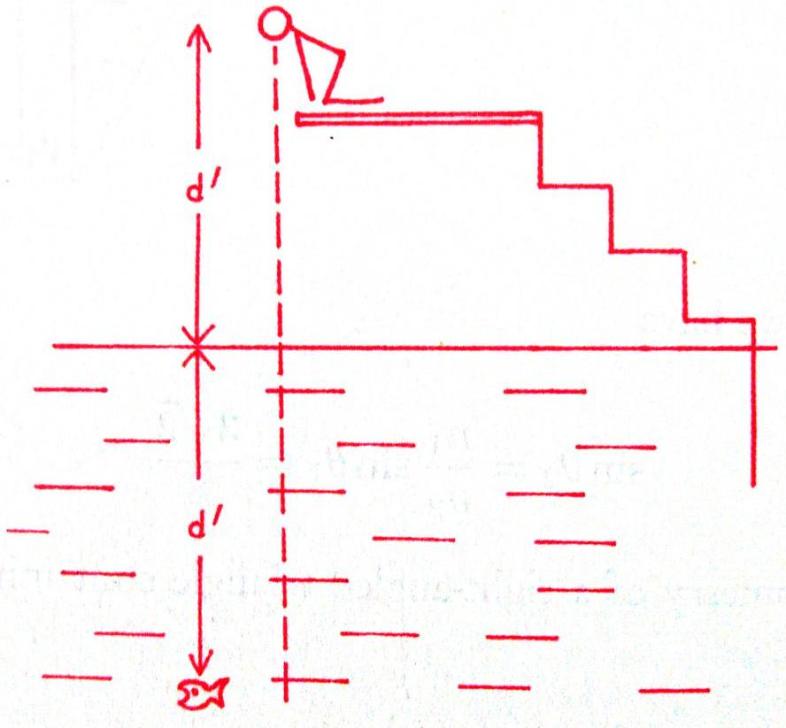

8. This question involves optical phenomena in two different contexts.
    (a) When you look with one eye at a diffuse source of light through a long, thin polished metal tube (e.g. a metre-long copper pipe used in domestic plumbing), you will see a pattern of rings.

At the centre there is a bright circle, which is the diffuse light seen directly through the hole. Surrounding this is a ring of light that is less bright than the central circle, and surrounding that is another ring that is less bright still, and so on. The rings become successively less bright until the tube appears dark.
Denote the length of the tube as $L$ and the inner diameter of the tube as $D$.

i. Derive an expression for the angle $\theta_{n}$ subtended at the eye by the $n$-th ring.
ii. Show that the rings appear to have approximately the same width, and derive an expression for this width.

(b) Binocular vision is useful for depth perception.
An observer, whose two eyes are a distance $d^{\prime}$ above the water surface, perceives a fish to be a distance $d^{\prime}$ directly (vertically) below the water surface. Let the separation between her eyes be $2 s$. Let the refractive index of water be $n$ and assume that the refractive index of air is 1 .

    i. Assuming that $s \ll d^{\prime}$, show that the true depth $d$ of the fish below the surface is approximately given by $d=n d^{\prime}$.
    ii. Now set $n=4 / 3$ and derive an exact expression for $d$, without making the assumption that $s \ll d^{\prime}$.
