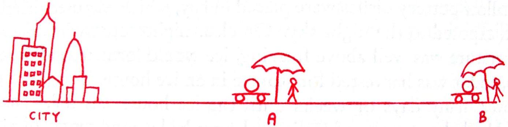

9. Assume a uniform desert outside the city. Entrepreneural ice resellers operate at point A and point B in the desert. The distance from the city to point B is double the distance from the city to point A , and it takes twice as long to travel from city to point B than it takes to go from city to point A.

The ice resellers can each buy a single solid uniform sphere of ice in the city. They then travel through the desert to their respective points A and B, journeying in the night so we can ignore radiation from the sun. Assume that the temperature of the desert is the same and constant during both journeys (this is the uniform desert approximation).

(a) If the reseller at point A leaves the city with a 800 kg sphere of ice and arrives at his stall with a 100 kg sphere of ice, what spherical mass of ice would the reseller at point B need to buy at the city in order to arrive at her stall with a 100 kg sphere of ice?
(b) If the reseller at point A with his 100 kg sphere had continued on without stopping, directly towards point B (and at the same speed), would the ice have completely melted before reaching B, exactly at B, or after passing B?
