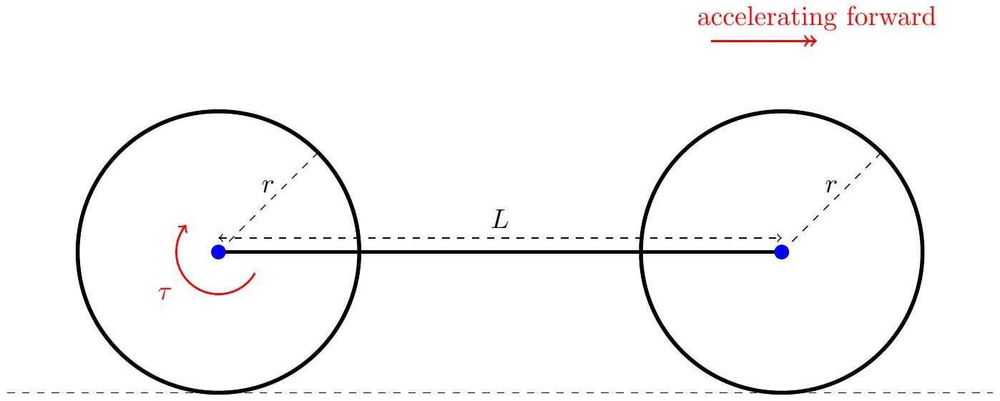
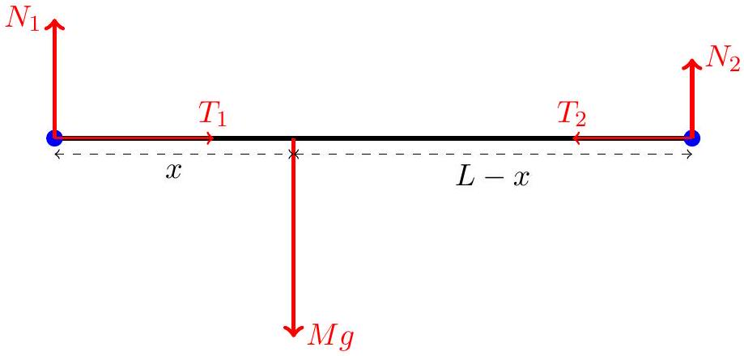

Q2 total: 7

3. In this problem, we consider a minimal mechanical model of a bicycle moving along a horizontal surface.
Model the wheels as two uniform solid disks of radius $r$, each of mass $m$ and moment of inertia $I$ about their centres. The wheels can rotate around their central axes and these axes are connected by a rigid bar of length $L$ and mass $M$. This bar represents the bicycle frame and rider, and we assume the bar is always horizontal with the centre of mass of this bar located a distance $x$ from the rear wheel (and thus a distance $L-x$ from the front wheel).
The rider exerts a pure torque $\tau$ on the rear wheel. The entire bicycle has linear acceleration $a$ in the forward direction. Assume that the wheels do not slip.

The free-body diagram of the bar (representing the frame and rider) is shown below. $N_{1}$ and $T_{1}$ are the vertical and horizontal forces respectively exerted by the rear wheel on the bar, while $N_{2}$ and $T_{2}$ are exerted by the front wheel on the bar.

(a) Write down an expression for acceleration $a$ in terms of $T_{1}, T_{2}$ and $M$.
(b) Write down an expression for $N_{2}$ in terms of $N_{1}$ and $M g$.
(c) Draw separate free-body diagrams for each of the rear and front wheels. Label the normal contact and frictional contact forces with the ground as $R_{1}=N_{1}+m g$ and $f_{1}$ respectively for the rear wheel, and $R_{2}=N_{2}+m g$ and $f_{2}$ for the front wheel.
(d) Determine an expression for $a$ in terms of $\tau, r, m, M$ and $I$.
(e) Suppose the frictional forces are maximal, i.e. $f_{1,2}=\mu R_{1,2}$ where $\mu$ is the coefficient of static friction (assumed to be the same for both wheels). Determine an expression for the ratio $R_{1} / R_{2}$ in terms of $r, m, M$ and $I$ and show that $R_{1} / R_{2}>1$.
