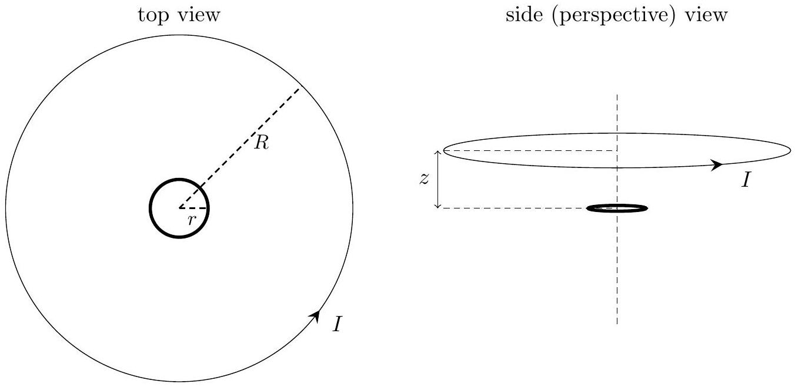

Q4 total: 13
5. Two thin rigid circular loops share a common axis as shown. We can ignore the effects of gravity in this question.

The larger loop is a conducting wire of radius $R$. This wire carries a constant current $I$, and slides up the axis at constant speed $v \ll c$ so that the distance $z$ between the two loops increases linearly with time $t$.

The other loop is a smaller insulating ring of radius $r \ll R$, with a uniform positive linear charge density of $+\lambda$ and a uniform linear mass density of $\rho$. The smaller loop can rotate freely around the central axis but cannot move up and down the axis.

At time $t=0$, the loops are co-planar (i.e. $z=0$ ) and the smaller loop is not rotating (i.e. angular speed $\omega=0$ ).

(a) Briefly explain why the smaller loop starts spinning and whether the orientation of this rotation is in the same or opposite sense as the current $I$ in the larger loop.
(b) The current $I$ in the larger loop produces a magnetic field. Using the Biot-Savart law, show that at the centre of the smaller loop, the magnetic flux density due to this current is directed upwards along the axis and has a $z$-dependence given by
$$
B_{I}(z)=\frac{\mu_{0} I R^{2}}{2\left(z^{2}+R^{2}\right)^{3 / 2}},
$$
where $\mu_{0}$ is the permeability of free space.
(c) The rotation of the smaller loop also contributes to the magnetic flux density at the centre of the smaller loop. Determine an expression, in terms of $\mu_{0}, \lambda, r$ and the angular speed $\omega$, for this rotational contribution $B_{\lambda}(\omega)$.
(d) Assume that the magnetic field within the entire area of the smaller loop is approximately constant and is the same as the field at the centre of the loop, such that the resultant magnetic flux density is $B(z, \omega)=B_{I}(z)+B_{\lambda}(\omega)$.
Determine the angular speed $\omega_{\infty}$ at long times $t \rightarrow \infty$, in terms of $\mu_{0}, I, \lambda, \rho, r$ and $R$.
