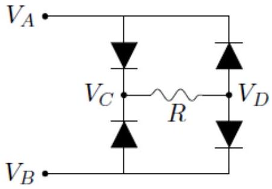
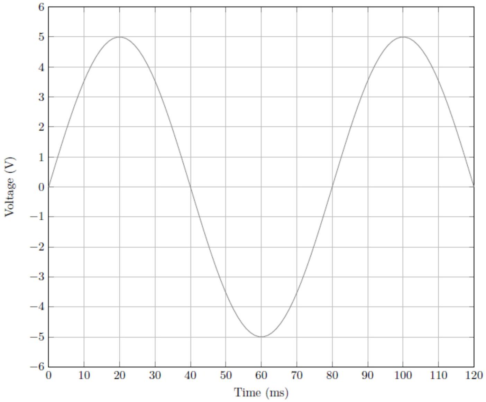
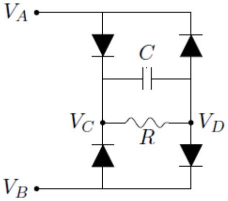

Q5 total: 13
6. For a certain circuit component shown below,

$$
V_{L} \cdot \longmapsto \cdot V_{R}
$$

the current $I$ is given by

$$
I=I_{0} \exp \left(\frac{-e V_{0}}{k T}\right)\left[\exp \left(\frac{e V}{k T}\right)-1\right],
$$

where $I_{0}=25 \mu \mathrm{~A}$ and $V_{0}=1.0 \mathrm{~V}, e$ is the elementary charge, $k$ is the Boltzmann constant, $T$ is the absolute (Kelvin) temperature, and $V=V_{L}-V_{R}$ is the potential difference (positive $V$ when $V_{L}>V_{R}$ corresponds to current flowing from left to right).
Throughout this problem, assume low temperature, i.e. $k T \ll e V_{0}$.

(a) Show some working and sketch a graph of $I / I_{0}$ against $V / V_{0}$.
[2]
(b) In the circuit below, a sinusoidal input voltage is applied across $V_{A B}=V_{A}-V_{B}$ as shown in the graph. The resistance $R=5.0 \Omega$.

i. Show some working and sketch $V_{C D}=V_{C}-V_{D}$ for the same time interval as shown for $V_{A B}$. Assume that $V_{A B}$ has been running for a long time.
ii. A capacitor $C=50 \mathrm{mF}$ is now added to the circuit, as shown below. [3]

Assume that the same sinusoidal input voltage $V_{A B}$ is applied as shown in the

graph, and has been running for a long time. Show some working and sketch the graph for $V_{C D}$ as a function of time with the capacitor added.
