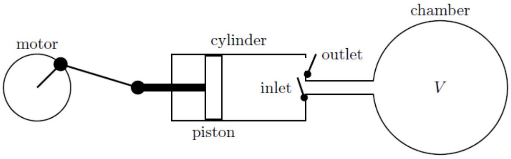

Q6 total: 8
7. A vacuum system consists of a chamber of constant volume $V$ connected to a pump mechanism in the form of a cylinder with a piston that moves left and right. As the piston moves, the minimum volume in the pump cylinder (to the right of the piston) is $V_{0}$, and the maximum volume is $V_{0}+\Delta V$. Assume that $\Delta V \ll V$.

The cylinder has two valves. The inlet valve opens when the pressure inside the cylinder is lower than the pressure in the chamber, but closes when the piston moves to the right. The outlet valve opens when the pressure inside the cylinder is greater than atmospheric pressure $P_{a}$, and closes when the piston moves to the left.
A motor drives the oscillatory motion of the piston. Each such complete pumping cycle takes a short time $\Delta t$. The piston moves at such a rate that heat is not conducted in or out of the gas contained in the cylinder during the pumping cycle. Assume that $\Delta t$ is a very small quantity, but that $\Delta V / \Delta t \equiv \alpha$ is finite.
The gas in the chamber is ideal monatomic and remains at a fixed temperature of $T_{a}$. At time $t=0$, the pressure inside the chamber is $P_{a}$. Start with the assumption that $V_{0}=0$ with the piston all the way to the right. Assume that there are no leaks in the system.

(a) State, for an ideal monatomic gas, the value of the adiabatic gas constant
$$
\gamma=\frac{C_{p}}{C_{v}},
$$
where $C_{p}$ is the heat capacity at constant pressure and $C_{v}$ is the heat capacity at constant volume.
(b) Determine an expression for the chamber pressure $P(t)$ at a later time $t$, and show that in the limit where $\Delta V / V$ vanishes, the pressure can be written as
$$
P(t)=P_{a} \exp \left(-t / \tau_{1}\right),
$$
where $\tau_{1}$ is expressed in terms of variables introduced in the problem statement.
Hint: You may use the following mathematical definition of Euler's number,
$$
e=\lim _{x \rightarrow 0}(1+x)^{1 / x}
$$
(c) Determine an expression for the temperature $T_{\text {out }}(t)$ of the gas as it is emitted from the pump cylinder into the atmosphere, and show that it can be written as
$$
T_{\mathrm{out}}(t)=T_{a} \exp \left(t / \tau_{2}\right),
$$
where $\tau_{2}$ is expressed in terms of variables introduced in the problem statement.

(d) Now assume that $0<V_{0}<\Delta V \ll V$. Determine an expression for the minimum possible pressure $P_{\text {min }}$ that is achievable in the chamber. You may express your answer in terms of $P_{a}, V_{0}$ and $\Delta V$.
